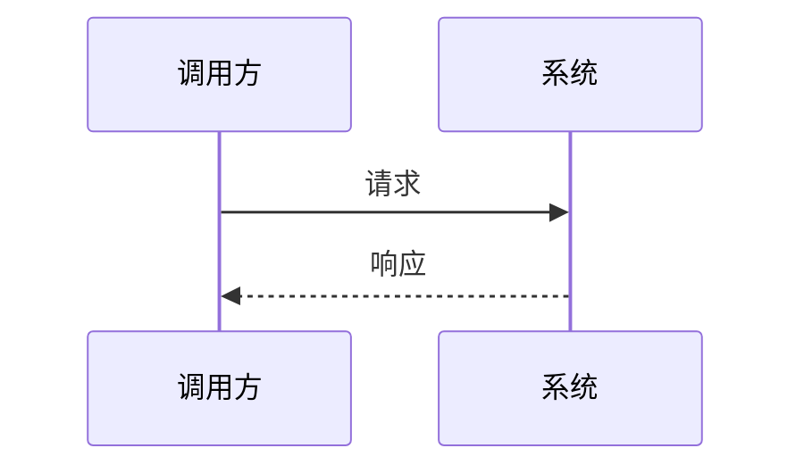

# 参考模板与约定

## 命名语言（必读）

- **标准目录与约定文件名（英文）**：专题根路径 **`learning/<技术专题中文简称>/`**；根下 **`ROADMAP.md`**（路线）、**`PROGRESS.md`**（进度）；各阶段目录内 **`THEORY.md`**（理论）、**`demo/`**（示例，内含 **`README.md`**）。便于跨工具、CI 与仓库内检索。
- **学习阶段内容（中文为主）**：**专题文件夹名**、**阶段文件夹名**（`序号-阶段中文名`）、**`demo/` 下子文件夹名**使用简短、可读的中文（如 `Spark 开发应用`、`01-核心概念与本地运行环境`、`01-变量与类型`）。上述 Markdown 的**标题与正文说明一律用中文**；引用官方英文名时可在括号内标注中文。
- **代码文件**：文件名按工具链惯例可用英文；在 `demo/README.md` 中用中文解释其作用；注释优先中文。

## 专题根目录文件（位于 `learning/<技术专题中文简称>/`）

建议路径：`learning/<技术专题中文简称>/`

| 文件 | 作用 |
|------|------|
| `ROADMAP.md` | 完整路线：阶段划分、每阶段目标、依赖顺序 |
| `PROGRESS.md` | 当前阶段、历史记录、待办 |

示例目录树（英文标准路径 + 中文阶段文件夹名）：

```
learning/<技术专题中文简称>/
├── ROADMAP.md
├── PROGRESS.md
└── 01-<阶段中文名>/
    ├── THEORY.md
    └── demo/
        └── README.md
```

## ROADMAP.md 结构

```markdown
# <技术领域> 学习路线

> 生成日期：YYYY-MM-DD  
> 说明：路线基于当时可查的公开资料与主流实践整理，学习过程中应以官方文档与社区为准。

## 领域概述
（1–2 段：该技术解决什么问题、典型应用场景）

## 学习原则
- 先官方文档与一手资料，再博文与视频
- 每阶段配合 `demo/` 中示例动手，再进入下一阶段

## 路线图

用一张**自上而下**的简单路线图，一眼看清阶段顺序（放在「路线总览」表格之前或之后均可）。

**推荐：ASCII（任意 Markdown 预览均可用）**

概念入门 / 环境搭建
        ↓
核心语法与模型
        ↓
实践项目 / 综合练习
        ↓
进阶：性能 · 工程化 · 部署（按领域选）

将每行替换为**本路线的真实阶段短名**；阶段较多时可换行继续 `↓`，保持单列向下。


## 路线总览
| 阶段 | 名称 | 预计周期（参考） | 核心产出 |
|------|------|------------------|----------|
| 1 | … | … | … |

## 各阶段详情

### 阶段 N：<阶段名>
- **目标**：…
- **核心主题**：…
- **实践要点**：…
- **推荐阅读**：写入阶段 **`THEORY.md`** 时用 **WebSearch**（或等价检索）为本阶段选取官方/一手文档，列出 **完整 URL** + 简要说明，并附 **检索关键词**（不在路线文件中预写链接示例）

## 从基础到实践到进阶
（简述如何覆盖：语法/模型 → 项目结构 → 测试/部署/性能/安全等）

## 路线审阅与确认
- [ ] 我已阅读本路线
- [ ] 我希望调整：…（可选）
- [ ] 确认开始阶段 1 学习：是 / 否
```

## PROGRESS.md 结构

```markdown
# <技术领域> 学习进度

## 元信息
- **技术方向**：…
- **学习路线文件**：`ROADMAP.md`
- **当前阶段**：阶段 N — <阶段名>（未开始 / 进行中 / 已完成）
- **上次更新**：YYYY-MM-DD

## 阶段清单（与路线一致）
| 阶段 | 状态 | 完成日期 | 累计学习时长 |
|------|------|----------|----------------|
| 1 | 未开始 | — | — |

## 阶段完成记录
（按时间倒序或正序，每条记录）

### 阶段 N — <阶段名>
- **完成日期**：YYYY-MM-DD
- **本阶段学习时长**：约 X 小时（用户填写或估算）
- **简要收获**：…（用户与助手共同更新）

## 备注
- 随时可向 AI 提问，补充本阶段文件夹内 `THEORY.md` 与 `demo/` 中的注释。
```

## 阶段文件夹布局

路径：`learning/<技术专题中文简称>/<序号>-<阶段中文名>/`

```
01-基础语法/
├── THEORY.md
└── demo/
    ├── README.md            # 必须：说明每个文件作用与学习顺序（全文中文）
    ├── 01-变量与类型/       # 可选：子主题中文文件夹
    └── ...
```

## THEORY.md 质量要求（必读）

生成 `THEORY.md` 时，在**紧扣本阶段路线目标**的前提下，尽量做到**内容充实、详细完整、可顺着读下来**，与 **`demo/`** 分工为：理论讲清「是什么 / 为什么 / 边界与关系」，动手细节以 `demo/README.md` 与示例文件为准。

**写作前对齐**：先阅读 `ROADMAP.md` 中本阶段的**目标、核心主题、实践要点**，必要时 **WebSearch** 该阶段在当下生态中的关注点；据此决定章节顺序、概念详略与示例方向。上一阶段已讲过的可点到为止，留给后续阶段的不必提前展开。

| 维度 | 要求 |
|------|------|
| **因阶段制宜** | **禁止套模板式堆砌**：小节标题、举例领域、术语深度须与本阶段一致；同一专题不同阶段的理论文档在结构上可以完全不同（例如入门阶段重环境与心智模型，进阶阶段重原理与权衡）。若路线将本阶段实践要点写得很具体，理论文中须有对应落点（概念或图示指向 **`demo/` 动手部分**将要触及的点）。 |
| **充实严谨** | **尽量充实**：覆盖路线中的核心主题且展开到位，避免只有标题与 Bullet、缺少解释与例证。**逻辑严谨、衔接完整**：先交代依赖知识与术语再使用；推理或操作步骤按顺序写清「因→果」或「前提→结论」；小节之间用一两句过渡，避免未解释跳跃（例如突然使用尚未定义的概念或缩写）。复杂命题可拆步说明或用小例子垫底再上抽象。 |
| **学习者视角** | **考虑读者此刻的理解程度**：与路线中本阶段定位一致——入门多直觉、类比与图示，少默认读者已懂行业黑话；进阶可收紧铺垫但仍避免悬空引用。专有名词与缩写**首次出现**宜给中文释义、简短定义或指向文中前置小节；同一文档内前后术语保持一致。 |
| **详细全面** | 覆盖本阶段在 `ROADMAP.md` 中列出的核心主题；每个重要概念尽量包含：**定义或直观解释**、**解决什么问题**、**与相邻概念的区别或依赖**、**典型用法与反例/不适用场景**。允许篇幅较长，但避免脱离本阶段的百科式扩展。 |
| **图文并茂** | 适合用图表达的内容（流程、架构、组件关系、时序、状态迁移、类/模块依赖等）使用 **Mermaid**（`flowchart`、`sequenceDiagram`、`stateDiagram-v2`、`classDiagram` 等按需选用）；可在图下列一两句中文说明读图要点。不支持 Mermaid 的环境可保留图代码块，必要时同一内容附加 **ASCII 简图**作保底。 |
| **代码举例** | 在理论文中**适当**插入短代码块：演示语法点、API 形态、配置片段或伪代码即可；注明语言标签（如 `python`、`java`、`sql`）。完整可运行示例放在 **`demo/`**，文中用一句话指向路径或文件名即可，避免把示例全文搬进理论文档。 |
| **结构清晰** | 章节层级一致（建议 `#` 文档标题 → `##` 大节 → `###` 小节）；核心概念分节撰写，复杂章节可加 **「本节小结」**；较长文档可在文首增加 **目录锚点**（Markdown 目录链接）。一级标题的具体取舍须遵守下一小节「章节组织」，避免各阶段目录雷同。 |

## THEORY.md 章节组织（路线优先，勿套「完整骨架」）

### 模板对生成内容的影响（必读）

若把某一 fixed 大纲当作「每阶段默认目录」，模型容易**机械复制同一套一级标题**（先学习目标、再知识图谱、再核心概念……），造成各阶段文档**结构雷同、内容为凑小节**，与上文「因阶段制宜」「禁止套模板式堆砌」相冲突。

**唯一纲**：本阶段在 **`ROADMAP.md` 中的目标、核心主题、实践要点**。先据此列出「本阶段必须讲清的若干主题」并安排顺序，再决定要不要下面的可选模块；**不要**先拿固定骨架再往里面填词。

### 推荐拟定顺序

1. **从路线抽取主题**：对应 `ROADMAP.md` 本阶段，写出 3～N 个要讲透的主题（标题尽量用**本领域真实名称**，避免泛化的「主题一 / 核心概念 2」）。
2. **选叙事主线**：同一批主题可以按「问题驱动」「时间线 / 请求链路」「分层模型」「对比与权衡」等不同线索组织——以读者最容易跟上本阶段难度的一种为准。
3. **按需拼接模块**：从下节「可选用模块」里挑**确实有用**的块；不需要的整块省略，可与正文合并（例如衔接不写独立一章，放在开篇两段即可）。

### 可选用模块（按需取用，不是必备 checklist）

下列每一项都是**可选**；入门阶段可能只需要「场景 + 心智模型 + 指向 demo」；进阶阶段可能以「原理分层 + 权衡表 + 边界」为主。**禁止**每个阶段都出现相同的一级标题序列。

| 模块 | 何时考虑使用 |
|------|----------------|
| **学习目标或开篇聚焦** | 可与路线一句话对齐，或融入第一段，不必单独成章 |
| **术语表 / 概念依赖图** | 术语多或大概念耦合强时；一张 Mermaid 或表格即可 |
| **分主题正文** | 主体；章节名应对应路线里的真实主题名 |
| **与前后阶段的承接** | 需要时写成短段落嵌在开头或结尾；多数阶段不必单列「与上一阶段衔接」一整节 |
| **误区、边界、限制** | 可与「注意点」合并；避免为空壳小节 |
| **自检或复习要点** | 概念密集阶段有用；可改为文尾简短小结 |
| **推荐阅读与检索词** | 通常保留在文末；撰写时用检索填入真实 URL（约定见下文「理论知识推荐阅读」） |

### 叙事变体示例（择一参考思路，勿当作固定标题）

以下为**思路示例**，不是要你照搬标题：同一专题不同阶段应呈现不同目录形态。

- **入门 / 心智模型类阶段**：真实场景或痛点 → 本阶段要解决什么 → 关键术语与直觉图像 → 与 `demo/` 的对应关系 → 延伸阅读。
- **机制 / 原理类阶段**：已知假设（承接路线）→ 分层拆解工作机制 → 与其他方案的对比或权衡 → 不适用边界 → 延伸阅读。
- **实践编排类阶段**：目标产出描述 → 前置条件与环境 → 步骤背后的概念（讲到够用为止）→ 常见踩坑 → 延伸阅读。

### 严禁的做法

- **整段复制**历史上常用的「Markdown 填空骨架」（固定多级标题清单）到每个阶段。
- **为满足目录**而添加空小节（例如没有衔接必要仍写「与下一阶段的衔接」）。
- **各阶段一级标题序列高度一致**，仅在二级标题换词。

须保持的仅是**叙事可读**：读者能回答「本阶段路线要求掌握什么、为什么、边界在哪」，而非填满某一固定目录。

**Mermaid 示例（可按需改写节点文案）**：

````markdown
### 概念关系示意


### 交互时序（可选）


````

## 理论知识推荐阅读（URL）— 编写约定

**不在本 reference 或技能文件中列举任何文档 URL 示例**；链接须在**编写该阶段 `THEORY.md` 时**结合专题与阶段主题，用 **WebSearch**（或打开官方站点核对）**实时检索并写入**，确保指向当前有效入口。

撰写各阶段 **`THEORY.md`** 时，除正文讲解外，须在文末提供 **推荐阅读**：优先 **官方文档 / 规范 / 权威教程** 的完整 URL，并附 **检索关键词**（便于读者日后自行更新检索）。

### 编写约定

| 项 | 要求 |
|----|------|
| **链接真实性** | 使用可访问的 `https://` 完整 URL；不确定路径时在撰写阶段文稿时用检索核对，**勿编造子路径**。 |
| **优先顺序** | 官方文档 → 标准机构 / 基金会站点 → 被广泛引用的开源权威教程 → 社区教程（注明性质）。 |
| **每条推荐阅读** | 建议格式：`- **标题或文档名** — <完整 URL>（一句话说明与本阶段的关系）`。 |
| **时效** | 以撰写当时检索到的官方文档入口为准；日后失效则重新检索替换。 |

## demo/README.md 必含内容

- 本阶段示例总览表：文件名/目录 → 对应知识点 → 建议操作顺序
- 环境要求（语言版本、工具）
- 如何运行每个示例（命令）
- 学习建议（先读哪个、再改哪段代码实验）

## 更新进度时的检查项

1. 将「当前阶段」推进到下一阶段或标记本阶段「已完成」
2. 更新「阶段清单」表格中的状态、完成日期、时长
3. 在「阶段完成记录」追加一条，含简要收获
4. 提示用户：可开始学习下一阶段，并说明下一阶段**阶段文件夹（中文名）**与入口文件（`THEORY.md`、`demo/README.md`）
