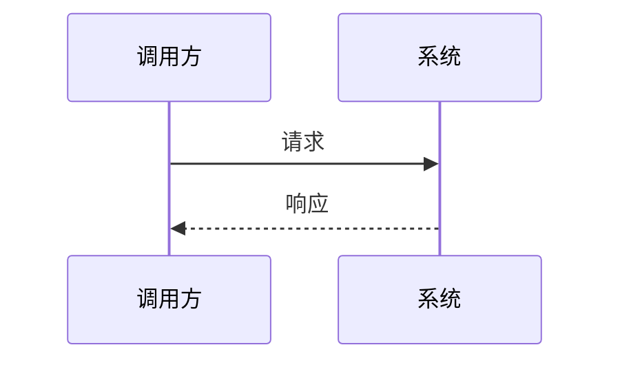

# THEORY.md 质量要求与章节组织（必读）

**与 `SKILL.md` 分工**：细则**以本文件为准**；`SKILL.md` 只写工作流与引用。

**目标**：紧扣 `ROADMAP.md` 本阶段，讲清「是什么 / 为什么 / 边界与关系」，**可独立当讲义读**；读者**先扫结构化知识点，再读论证与例子**，不必在长段里自行提炼。可运行细节见 `demo/README.md`。写作前读路线 **目标、核心主题、实践要点**；必要时 **WebSearch**；上一阶段已讲过的点到为止。推荐阅读 URL 见 [theory-recommended-reading.md](theory-recommended-reading.md)。

**底线（三条）**：① **路线对齐**——`ROADMAP.md` 核心主题（含子点）逐项至少 **≥ 一段**展开；可加表 **「路线要点 ↔ 本文章节」**。② **反提纲**——禁止整节**只有表/列表、无连续因果叙述**；索引层（下表「1. 索引层」）**不可替代**后文论证。③ **版式**——最外 **`## 一、`、`## 二、`…**；目录**只**从路线来，禁止套固定多级标题骨架。

---

## 篇幅与密度（软目标）

若 `ROADMAP.md` 另约篇幅，以路线为准；否则：

| 阶段类型 | 正文规模（不含代码块、Mermaid、推荐阅读） |
|----------|---------------------------------------------|
| 入门 / 心智模型 / 综述 | **约 4000～9000 汉字**；低于 **约 3000** 须加厚（解释、对比、边界、例子），用 **知识点表 + `###` + 表/图** 拆开，勿单段堆字 |
| 机制 / 原理 / 中间件 | **约 3500～8000 汉字** |
| 纯实操编排 | **约 2000～5000 汉字**，讲清每步为什么与常见失败 |

加厚优先论证与例证；**禁止**空洞形容词与同义重复凑字。

---

## 易学版式：一节之内的推荐顺序

顺序与是否写某一子题**完全服从 `ROADMAP.md`**；下表是**版式分工**，不是固定叙事模板。

### 三层分工（索引 → 论证 → 具象）

| 层 | 读者得到什么 | 写什么 | 硬规则 |
|----|----------------|--------|--------|
| **1. 索引层** | 本节要掌握的术语抓手 | 每个 **`## 一、`…** 在首段（**建议 ≥4 句**承上启下、动机、结论取向）之后，设 **「知识点（对应本节）」**：**表格优先**（列宜少，如 `# \| 知识点 \| 抓住什么`），或 **3～8 条**分条（每条：**术语 + 半句抓手**）。文首可选 **本阶段知识地图**（主题 ≥4 或章节长时） | 不写长论证；**禁止**与下段逐句重复 |
| **2. 论证层** | 因果、边界、易混点 | **`###` 小标题**（领域词 + 判断点）；段落用完整句（「之所以…」「若…则…」）；需列表时 **列表前一句总起、后一句收束**，编号项 **句句带机制或代价** | 每 **`## 一、`…** 建议 **≥2 个 `###`**（极短节除外）；**`###` 下**先加粗结论或短起句，再 **2～5 句**（单段过长则拆） |
| **3. 具象层** | 可对照记忆与动手 | **短例**（嵌入「例如…」1～3 句；正/反例可各一行）；**对比表**；**Mermaid**（流程/拓扑/时序/状态）；**点名 `demo/`** 路径。入门类建议 **≥2 张**有意义图（无可图示则免强） | 每实质 **`## 一、`…** 至少 **1 处**具象化；**图前一句读图目的，图下 1～2 句**；正文**短代码片段**，完整脚本在 `demo/` |

**列表节奏**：避免 **连续 4 条以上** `-` / `1.` 中间无叙述；可把长列表拆成多段或收入表。

### 写作要素速查（与上表配合，不另起一套要求）

| 要素 | 要求 |
|------|------|
| 动机 | 常放在 **`## 一、`…** 首段；因果句，忌开篇堆术语 |
| 概念 | **口语一句 → 定义 → 边界 / 与相邻概念差在哪**；易混用短表或一段对照 |
| 示例 | 贴本阶段；忌空泛「假设有个系统」 |
| 结论与风险 | 结论带依据；风险写具体现象，应对写可执行手段（禁空话式「加强监控」） |

### 节毕自检（约 30 秒）

只看 **一级小标题 + 知识点表头 + 路线↔章节表头**：能否说清 **3 条主线**？本节路线子项是否都有正文展开？是否出现「整节只有表/列表」？

---

## Markdown 层级与示例骨架

| 规则 | 说明 |
|------|------|
| 标题 | `#` 仅文档标题；正文 **`## 一、`…** 顺排；文末 **`## 推荐阅读`** 等导航标题文案固定 |
| 块内 | **`1.`** 与 **`-`**；可缩进子层；勿用 `1.1.` 作行首；勿用顶层 `1.2.3.` 代替 `##` |
| 表与图 | 表：定义、对比、决策、故障、**知识点索引**、路线↔章节；图：**一图一表意**，不必为配图而配图 |
| 代码 | 正文只放短片段；长示例在 `demo/` |
| 衔接 | 先定义再使用；小节过渡；重要概念带反例或边界 |

**骨架示例**（内层 fence 仅作示意；若渲染器嵌套异常，写作时用更长外层 fence 或拆开展示）：

```markdown
# 某阶段：……

## 一、第一大段：自解释标题

（首段 ≥4 句：承上启下、动机、结论取向。）

**知识点（对应本节）**

| # | 知识点 | 抓住什么 |
|---|--------|----------|
| 1 | 术语 A | 一句抓手 |
| 2 | 术语 B | 一句抓手 |

### 辅助小标题

**本块结论。** ……

1. ……
2. ……

（Mermaid：图前一句 + 图 + 图下 1～2 句。）

---

**本节提要（延伸学习）**
……
```

---

## 章节组织（路线优先）

**唯一纲**：`ROADMAP.md` 的目标、核心主题、实践要点。**拟定顺序**：从路线抽 3～N 主题 → 选一条线索（问题驱动 / 链路 / 分层 / 对比）→ 合并进正文，**不要**先拿固定骨架再填词。

**可选用模块**（按需；少章合并大节，禁止「少章 = 短文提纲」）：

| 模块 | 何时用 |
|------|--------|
| 本阶段知识地图 | 主题多或章节长；编号或表，与 **一～N 节**对应 |
| 术语表 / 概念图 | 术语多或耦合强 |
| 分主题正文 | 主体；`###` 标题用领域真实名称 |
| 承接上/下阶段 | 多嵌入段首段尾 |
| 误区与边界 | 合并写，忌空壳节 |
| 推荐阅读 | 文末；URL 见 theory-recommended-reading |
| 本节提要 | 每个实质 **`## 一、`…** 末尾必备（见下节） |

**叙事线索示例**（勿固定标题）：入门「痛点 → 术语与直觉 → demo」；原理「假设 → 机制分层 → 权衡 → 边界」；实操「产出 → 环境 → 概念 → 踩坑」。

**严禁**：整段复制固定 Markdown 填空；为空目录加小节；各阶段一级标题序列高度雷同。

---

## 每节末尾：核心概念与拓展提问（必备）

每个实质 **`## 一、`…** 块末尾（下一 `##` 之前）附：

| 要素 | 要求 |
|------|------|
| **核心概念** | **3～6 个**关节短语，与正文及索引层术语一致 |
| **拓展提问提示词** | **`>` 块内**一段可**单独粘贴到任意 AI** 的中文：写全主题、概念名、任务与期望产出；**不**依赖会话、附件、「上文」等指代；**禁止**身份铺垫；**禁止**各节共用同一段只改标题。块外可加：「以下整段复制到任意对话即可」 |

`#` 导读、`## 推荐阅读` 等可省略提要。提要**不计入**首段「≥4 句」；正文论证仍须写满。

**提要示例**：

```markdown
---

**本节提要（延伸学习）**

- **核心概念**：…；…；…
- **拓展提问提示词**

> 主题：……（写全）。核心概念：…、…（写全）。请拓展：……（范围与期望产出写清）。
```

---

## Mermaid 示例

````markdown



````
