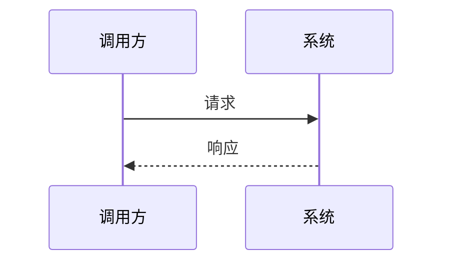

# THEORY.md 质量要求与章节组织（必读）

**与上级目录 `SKILL.md` 的分工**：`THEORY.md` 的可执行细则**以本文件为准**；`SKILL.md` 只负责工作流与引用，避免两处重复叙述同一规则。

生成 `THEORY.md` 时，在**紧扣本阶段路线目标**的前提下做到**充实、可顺着读**；与 **`demo/`** 分工为：理论讲清「是什么 / 为什么 / 边界与关系」，可运行细节以 `demo/README.md` 与示例为准。

**结构化呈现（对生成模型的显式要求）**：正文在满足下文「反提纲」的前提下，**优先**采用**带序号的分层结构**：**第一层用有序列表 `1.` `2.`**；**第二层用嵌套有序列表**（在首层条目下缩进后再写 `1.` `2.`，阅读上对应「1.1、1.2」式子项，见「结构化输出」示例）；**第三层及以下并列细节统一用 `-` 无序列表。** 辅以**表格**（定义、对比、决策、检查清单类信息尽量表格式）、**具象举例**（场景、数字、故障、前后对比）以及**图**（Mermaid / ASCII，细则见「结构化输出」）。目标是读者**扫一眼能抓结构、顺着序号能跟思路**，而非大段无标记散文。

**写作前**：读 `ROADMAP.md` 本阶段 **目标、核心主题、实践要点**；必要时 **WebSearch** 当下生态关注点，定章节顺序与详略。上一阶段已讲过的可点到为止，后续阶段内容不提前展开。

文末 **推荐阅读** 的 URL 与检索约定见 [theory-recommended-reading.md](theory-recommended-reading.md)。

**规则层级（给生成模型与人工自检）**：**反提纲 + 通俗化 + 路线对齐**是底线（不可为「好看列表」牺牲连续叙述）；**结构化输出**是呈现细则（序号、分点、表格、图、举例的用法）；**呈现与载体**只保留与 `demo/`、标题层级衔接的要点，**不重复展开**结构化细则。后文 **「章节组织」** 管目录从 `ROADMAP.md` 推导，与呈现细则正交。

---

## 篇幅与密度（软目标，写完后自检）

以下为**软目标**。若 `ROADMAP.md` 在本阶段详情中**明确约定**更短篇幅（如「速览 / 附录 / 半日」并写出期望字数或页数），以路线为准，并在文稿中保持**反提纲**（段落叙述比例）不降级。未作例外约定时，**心智模型 / 入门 / 概念密集型阶段**默认应明显长于「提纲」。

| 阶段类型（见 `ROADMAP.md` 表述） | 正文规模（软目标） |
|----------------------------------|-------------------|
| **入门、心智模型、综述类** | 正文（不含代码块、Mermaid、推荐阅读）建议 **约 4000～9000 汉字**；若明显低于 **约 3000 汉字**，视为不合格，应**加厚解释、例子、对比、边界**，而非新开脱离路线的主题。 |
| **机制、原理、中间件深度类** | 建议 **约 3500～8000 汉字**；技术细节多时可偏上限，但仍须保持段落叙述比例（见下「反提纲」）。 |
| **纯实操编排类**（以步骤为主） | 可与 `demo/README.md` 分工：理论仍建议 **约 2000～5000 汉字**，讲清**每步背后的为什么**与常见失败模式。 |

**加厚优先级**：先写满「路线核心主题」的论证链与例子；再考虑拓展阅读级内容。篇幅不足时**禁止**用空洞形容词或重复标题凑字。

---

## 通俗化、路线对齐与反提纲（合并执行）

以下三条一起自检。已在 **「结构化输出」** 用表格写清的呈现要求，此处**不再用长列表复述**（避免与后文叠床架屋）。

### A. 通俗化（听得懂）

- **开篇钩子**：首段或第一节用**具体场景**（故障、告警、重复写入、不一致等）点明痛点，再进入模型。
- **术语**：重要术语走 **口语一句 → 正式定义 → 微型例子**；避免缩写连击无中文抓手。
- **对比**：凡「单机 vs 分布式」「本地线程池 vs 集群」等，用**短对照表或一段对比**写清，减少误迁直觉。
- **列表节奏**：**避免连续 4 条以上列表项中间无段落**；列表用于归纳，段落讲因果。分点层级**充分利用 Markdown 列表语法**：**`1.` → 缩进后子层 `1.`（视作 1.1 档）→ 再深只用 `-`**；**无顺序的纯并列**顶层可直接 `-`。列表前可用**一两句**说明「下面 N 点分别对应什么」。细则与示例见 **「结构化输出」**。
- **读者路径（易学）**：复杂机制可在展开前给 **2～3 句「读完能做什么 / 能避免什么」**（非摘要标题）；`##` / `###` 标题尽量**自解释**（含领域词，少用空洞的「概述」「补充」）；同一屏内**新术语**不宜堆砌，必要时指回术语表或前置节。

### B. 与路线逐条对齐（全面）

- `ROADMAP.md` 本阶段 **核心主题**（及详情中的子点）= **检查清单**：每个主题至少 **≥ 一段**专门展开（可分散在不同小节，不可仅标题带过）。
- 主题 ≥4 且易漏检时，可加小表 **「路线要点 ↔ 本文章节」**（可选，非固定目录）。

### C. 反提纲（禁止只有骨架）

- 每个 **`##` 大节**至少 **一段连续叙述**（建议 **≥4 句**）：承上启下、动机、本节结论取向；**不能整节只有列表**。
- **禁止**「一句定义 + 十条 bullet」即结束；关键 bullet 宜有**半句至两句**展开，或紧跟一段合并说明。
- **禁止**「详见后文」式悬空：单读该节也能回答**为什么在乎、结论是什么、对应 demo 哪一部分**。

---

## 结构化输出：序号、分点、表格与图例（生成优先）

在**不违背**上文「反提纲」（每 `##` 须有连续叙述、禁止整节只有列表）的前提下，**尽量**按下列方式组织知识点，便于复习与对照路线。

| 手段 | 怎么用 | 与反提纲如何共存 |
|------|--------|------------------|
| **序号与层级（Markdown）** | **第一层**（顺序、步骤、因果链、优先级）：顶层有序列表，条目标记为 `1.` `2.` `3.`（或段落内「第一步…」与列表二选一，勿叠床架屋）。**第二层**（「1.1」档）：在某一 `1.` 条目**正文下一行**起，**缩进**（建议 3 空格，与常见渲染器兼容）后再写子层 `1.` `2.` `3.`——即用**嵌套有序列表**表达子编号，**不要**在行首写 `1.1.` `2.3.` 充当列表标记（解析易歧义）。**第三层及以下**：子子点一律 **`-` 无序列表**（可继续缩进嵌套 `-`），不再叠第四层有序，避免层次混乱。**纯并列、无先后**时顶层可直接 `-`，不必强行套 `1.`。整体嵌套建议 **≤3 个视觉层级**（过深则改 `###` 小标题或表格）。 | 在首层 `1.` 列表**前**写一小段动机；**关键条目**后接半句至两句展开，或列表后**收束**一段；**禁止**同一缩进层级混用「有序 + 无序」冒充二级（二级须是缩进后的子列表）。 |
| **分点（并列）** | 同一层级内的并列特征、优缺点、注意事项，用 **`-`**；若并列块本身从属于某一「1.1」档论点，则该档下先嵌套 `1.` `2.`，再在其下用 `-` 展开细节。 | 分点**前**用一句话说明「从哪几个维度看」；**禁止**只有标题 + 十条单词级 bullet。 |
| **表格化** | **定义**（术语 / 含义 / 典型场景）、**对比**（方案 A vs B：适用、代价、复杂度）、**决策**（若…则…）、**故障—现象—可能原因—处置**、**路线要点 ↔ 本文章节**等，**优先用 Markdown 表格**；列数过多时可拆成两张表或「主表 + 附注段落」。 | 表前**一句**说明表的目的；表后**至少一句**解读或指出表中例外/边界。 |
| **举例** | 每承载实质内容的 **`##` 大节**内，至少 **1 处**具象化：**小场景**、**简化数字**、**一次请求/一次故障**、**与 demo 类名的对应**（不写长代码）。抽象讲三遍不如一个可想象的例子。 | 例子嵌入叙述或放在「例如」引导的独立小段；避免例子与正文论点脱节。 |
| **图文并茂** | **一图一表意**。流程/架构/时序/状态优先 **Mermaid**（如 `flowchart`、`sequenceDiagram`、`stateDiagram-v2`、`classDiagram`）；**心智模型 / 入门类阶段**建议 **≥2 张**有意义图（如流程 + 时序/状态），除非确无可图示；必要时 **ASCII** 示意保底。与**表格**分工：**图**承载动态、拓扑、时序；**表**承载静态对照、属性矩阵。图下附 **1～2 句**读图说明；勿把正文整段复制进图注。 | 图/表前用**过渡句**说明「为何此时看图」；与反提纲共存方式同表内其他行。 |

**自检（生成后扫一遍）**：每个主要 `###` 是否**一眼能看出**「先讲什么、再讲什么」；核心论证若**明显适合**表或图（对照关系、流程、状态迁移），正文里**宜有**对应表或图；纯叙事或一次性例外说明不必为配图而配图。

**列表层级示例（生成时可作模板）**：

```markdown
1. 一级：有顺序的主线论点或步骤
   1. 二级：嵌套有序（阅读上即「1.1」类子论点）
      - 三级及以下：并列细节、注意点
      - 仍属该子论点下的补充
   2. 二级：下一子论点
2. 一级：下一大步或下一主题
```

---

## 呈现与载体（与 demo、标题层级衔接；结构化细则见上文）

| 维度 | 要求 |
|------|------|
| **因阶段制宜** | 小节标题、举例领域、术语深度与本阶段一致；**禁止**各阶段复制同一套一级标题填空。路线中的**实践要点**须在理论中有落点（可图示指向将动手的 `demo/` 点）。 |
| **结构化呈现** | **序号、分点、表格、图、举例** 的粒度、自检与和反提纲的配合，**一律以「结构化输出」节的表格为准**；本节不重复。 |
| **代码举例** | 正文只放**短**代码/配置/伪代码片段并标明语言；完整可运行示例放 **`demo/`**，正文一句话指路径或类名。 |
| **结构清晰** | 建议 `#` → `##` → `###`；长文文首可 **目录锚点**；复杂大节可加 **「本节小结」**（论证收束，可用编号列 3～5 条 takeaway）。**「本节小结」** 与 **`##` 末尾的「本节提要（核心概念 + 拓展提问）」** 不同：前者在节内收束要点，后者为固定延伸学习块。一级标题取舍须遵守下文「章节组织」。 |

**论证与衔接**（不单列表格）：**充实、严谨、读者水平匹配** = **B + C** + **A**（含术语、对比与读者路径）；须 **先定义再使用**、**小节间过渡**、**重要概念含边界或反例**。

---

## 每节末尾：核心概念与拓展提问（必备）

便于学完后**自行加深、加宽**：每个**知识大节**（对应正文中的每个 **`##` 标题块**：该 `##` 下全部 `###` 正文结束之后）须附一段**固定形态的提要**，**放在该大节末尾**（紧接下一 `##` 之前）。文首目录不必为「本节提要」单独列锚点（可选）。

| 要素 | 要求 |
|------|------|
| **核心概念** | **3～6 个**短名或短语，为本节「关节概念」（读者背/check 用）；与正文术语一致，避免空泛词。 |
| **拓展提问提示词** | **引用块（`>`）内**写**一段自包含的任务中文**：直接陈述要对方讲什么、产出什么，须**嵌入本节标题与上述核心概念专名**，并写明拓展方向（更深原理、与替代方案对比、生产故障与观测、与本阶段其他节/路线关联、常见误解等）。**禁止**在引用块内写「我已阅读本节」「我是初学者」等**对话前文或身份铺垫**——那些话换模型、新开会话即失效。此类提示放在引用块**外面**单独一行（如「仅复制下方引用块内文字，可粘贴到任意 AI」）。**禁止**各节共用同一段万能话只改标题。 |

**推荐排版示例**（可照抄结构，内容随节而变）：

```markdown
---

**本节提要（延伸学习）**

- **核心概念**：…；…；…（3～6 个，用中文分号或顿号分隔亦可）
- **拓展提问提示词**  
  - *（单独说明，勿复制进模型）*：只复制下一则 **引用块内的全文**；勿加「我已读过某文档」等上文，便于粘贴到**任意** AI 的新会话。  
  - 引用块内应为**独立任务说明**（嵌入本节主题名与核心概念），例如要求先对比再给结论、先列提纲再展开、标注不确定处并给检索关键词等。

> 请围绕「……（本节 `##` 标题要点）」展开，涉及概念：…、…、…。请……（具体任务与期望产出）……
```

**范围说明**：仅 **`#` 文档标题**、**全文导读**、**推荐阅读**等结构性章节可省略本块；凡承载实质知识点的 **`##` 大节**均须有。**纯目录/导航**、仅含锚点列表而无讲解的 `##`（如「目录」）可省略；一旦该 `##` 下出现概念性说明，则须附本块。阶段若经 `ROADMAP` 明确为「极短附录」且全文仅一个 `##`，仍须在**该节**末尾附本块。

**与反提纲的关系**：提要块**不计入**「每 `##` 须有 ≥4 句连续叙述」的正文统计；正文仍须在提要之上写满论证。工作流 C 中若**新增或拆分 `##` 大节**，须补写对应提要块。

---

# 章节组织（路线优先，勿套「完整骨架」）

## 模板对生成内容的影响（必读）

若把某一 fixed 大纲当作「每阶段默认目录」，模型容易**机械复制同一套一级标题**（先学习目标、再知识图谱、再核心概念……），造成各阶段文档**结构雷同、内容为凑小节**，与 **因阶段制宜**（见「呈现与载体」）及 **反提纲** 要求相冲突。

**唯一纲**：本阶段在 **`ROADMAP.md` 中的目标、核心主题、实践要点**。先据此列出「本阶段必须讲清的若干主题」并安排顺序，再决定要不要下面的可选模块；**不要**先拿固定骨架再往里面填词。

## 推荐拟定顺序

1. **从路线抽取主题**：对应 `ROADMAP.md` 本阶段，写出 3～N 个要讲透的主题（标题尽量用**本领域真实名称**，避免泛化的「主题一 / 核心概念 2」）。
2. **选叙事主线**：同一批主题可以按「问题驱动」「时间线 / 请求链路」「分层模型」「对比与权衡」等不同线索组织——以读者最容易跟上本阶段难度的一种为准。
3. **按需拼接模块**：从下节「可选用模块」里挑**确实有用**的块；不需要的整块省略，可与正文合并（例如衔接不写独立一章，放在开篇两段即可）。

## 可选用模块（按需取用，不是必备 checklist）

下列每一项都是**可选**，表示**是否单独成章**，不是「可以少写字」。**篇幅软目标、反提纲、路线对齐与结构化呈现**仍须满足；少章时把内容**并入较少的大节**，禁止用「章节少」换「短文 + 提纲」。

入门可侧重「场景 + 心智模型 + 指向 demo」的叙事，进阶可侧重「原理分层 + 权衡 + 边界」。**禁止**每个阶段使用相同的一级标题序列。

| 模块 | 何时考虑使用 |
|------|----------------|
| **学习目标或开篇聚焦** | 可与路线一句话对齐，或融入第一段，不必单独成章 |
| **术语表 / 概念依赖图** | 术语多或大概念耦合强时；一张 Mermaid 或表格即可 |
| **分主题正文** | 主体；章节名应对应路线里的真实主题名 |
| **与前后阶段的承接** | 需要时写成短段落嵌在开头或结尾；多数阶段不必单列「与上一阶段衔接」一整节 |
| **误区、边界、限制** | 可与「注意点」合并；避免为空壳小节 |
| **自检或复习要点** | 概念密集阶段有用；可改为文尾简短小结 |
| **推荐阅读与检索词** | 通常保留在文末；撰写时用检索填入真实 URL（约定见 [theory-recommended-reading.md](theory-recommended-reading.md)） |
| **本节提要（核心概念 + 拓展提问提示词）** | 非独立成章；**每个 `##` 知识大节末尾必备**，格式见上文「每节末尾：核心概念与拓展提问」 |

## 叙事变体示例（择一参考思路，勿当作固定标题）

以下为**思路示例**，不是要你照搬标题：同一专题不同阶段应呈现不同目录形态。

- **入门 / 心智模型类阶段**：真实场景或痛点 → 本阶段要解决什么 → 关键术语与直觉图像 → 与 `demo/` 的对应关系 → 延伸阅读。
- **机制 / 原理类阶段**：已知假设（承接路线）→ 分层拆解工作机制 → 与其他方案的对比或权衡 → 不适用边界 → 延伸阅读。
- **实践编排类阶段**：目标产出描述 → 前置条件与环境 → 步骤背后的概念（讲到够用为止）→ 常见踩坑 → 延伸阅读。

## 严禁的做法

- **整段复制**历史上常用的「Markdown 填空骨架」（固定多级标题清单）到每个阶段。
- **为满足目录**而添加空小节（例如没有衔接必要仍写「与下一阶段的衔接」）。
- **各阶段一级标题序列高度一致**，仅在二级标题换词。

须保持的仅是**叙事可读**：读者能回答「本阶段路线要求掌握什么、为什么、边界在哪」，而非填满某一固定目录。

## Mermaid 示例（可按需改写节点文案）

````markdown
### 概念关系示意


### 交互时序（可选）


````
