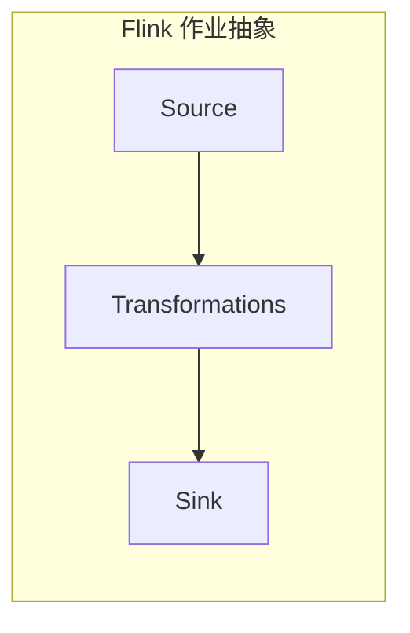
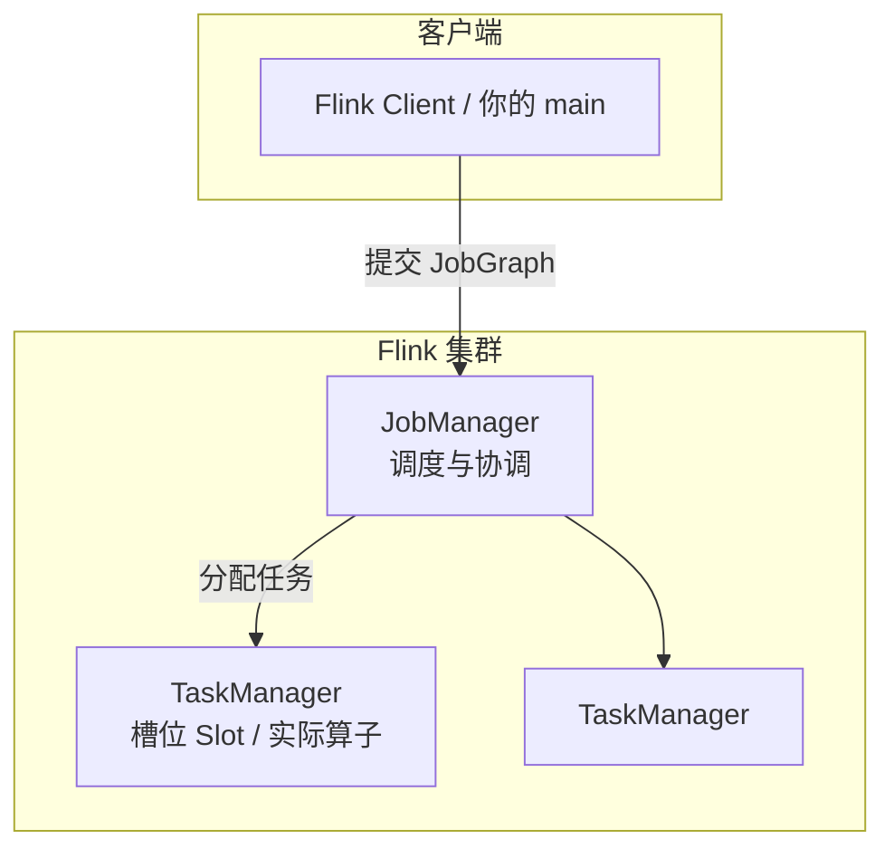

# 阶段：概念与本地环境 — 理论知识

## 本阶段学习目标

- 说清楚 Flink 解决什么问题，以及 **DataStream** 与 **Table / SQL** 两条路线各自擅长什么。
- 能在图上指出 **Client、JobManager、TaskManager** 的职责，并理解 **并行度（Parallelism）** 与 **Slot** 的直觉含义。
- 能在本机用 **Maven + Java** 编译并运行一个最小的 DataStream 作业（见 `demo/`），并理解 **`execute()` 触发惰性执行**。
- 知道本地调试常用 **`createLocalEnvironment()`** / 默认 **`getExecutionEnvironment()`** 的差异直觉，以及后续如何从日志与 Web UI 观察作业（深入在阶段 5）。

## 目录

- [本阶段学习目标](#本阶段学习目标)
- [Flink 是什么：流与批的统一视角](#flink-是什么流与批的统一视角)
- [核心运行时组件](#核心运行时组件)
- [API 分层：从 SQL 到 ProcessFunction](#api-分层从-sql-到-processfunction)
- [并行数据流：分区与交换模式](#并行数据流分区与交换模式)
- [第一个程序的结构（惰性执行）](#第一个程序的结构惰性执行)
- [本地运行方式一览](#本地运行方式一览)
- [与下一阶段的衔接](#与下一阶段的衔接)
- [常见误区与注意点](#常见误区与注意点)
- [自检清单](#自检清单)
- [推荐阅读与扩展资料](#推荐阅读与扩展资料)
- [本阶段理论知识小结](#本阶段理论知识小结)

## Flink 是什么：流与批的统一视角

数据处理可以围绕两类数据组织：

- **有界流（Bounded）**：输入可以在有限时间内读完（例如一天的分区日志），更接近传统「批」的直觉。
- **无界流（Unbounded）**：输入理论上持续到达（Kafka、点击流、IoT），需要持续产出结果。

Flink 将二者都建模为 **数据流上的程序**：应用是由 **Source → Transformations → Sink** 构成的有向图；无界场景强调 **低延迟、状态与容错**，有界场景则可退化为批式语义的一次执行。本阶段只需建立印象：**先会把作业看成一张并行执行的算子图**，细节留到后续阶段。

## 核心运行时组件

部署与组件权威说明见官方 [Deployment 概述](https://nightlies.apache.org/flink/flink-docs-stable/docs/deployment/overview/)（下文链接均为撰写时核对的 **Stable** 文档入口）。

| 组件 | 直觉职责 |
|------|----------|
| **Client** | 运行你的 `main`，把程序翻译成 Flink 可执行的 **JobGraph**（并连同依赖）提交给 JobManager；在 Session 等模式下客户端可能较重。 |
| **JobManager** | 调度、协调 Checkpoint、处理故障恢复与高可用相关逻辑（实现随部署模式变化）。 |
| **TaskManager** | 真正执行 **算子子任务（subtask）** 的进程；资源通常以 **Slot** 为粒度划分。 |

**并行度**：某个算子的 **并行实例个数**，一般对应多个 subtask。**Slot** 可粗略理解为 TaskManager 上能「同时跑多少个并行 subtask」的资源单元（具体调度规则以官方配置为准）。

## API 分层：从 SQL 到 ProcessFunction

官方 [Concepts — Overview](https://nightlies.apache.org/flink/flink-docs-stable/docs/concepts/overview/) 说明了抽象层次：**SQL / Table API** 声明式、可走优化器；**DataStream API** 命令式、适合细粒度状态与时间控制；更底层的 **ProcessFunction** 嵌入在 DataStream 中按需使用。二者还可互转（后续 Table 阶段再展开）。

本阶段路线选择 **DataStream** 作为第一个可运行 demo，原因是：**心智模型最直接**（Source、算子链、Sink、`execute()`），与官方 DataStream 编程指南一致（见推荐阅读）。

## 并行数据流：分区与交换模式

[Learn Flink — Hands-On Training](https://nightlies.apache.org/flink/flink-docs-stable/docs/learn-flink/overview/) 中「Parallel Dataflows」一节用很短篇幅说清了要点：

- 流在算子之间传递时可呈 **一对一（forward）** 或 **重分区（redistribute）** 模式。
- **`keyBy`** 等会按 key 重新分区，使得相同 key 的事件进入同一并行实例，以便做聚合、状态计算等。

本阶段只需记住：**并行度 + 分区方式** 决定了事件如何在集群中流动；**乱序与窗口** 在阶段 2 展开。

## 第一个程序的结构（惰性执行）

[Flink DataStream API — Overview](https://nightlies.apache.org/flink/flink-docs-stable/docs/dev/datastream/overview/) 概括了固定骨架：

1. 获取 `StreamExecutionEnvironment`
2. 定义 Source，得到初始 `DataStream`
3. 编写 transformations（`map`、`flatMap`、`filter`、`keyBy`、窗口等）
4. 定义 Sink（`print()`、文件、Kafka 等）
5. 调用 **`env.execute()`**（或异步 `executeAsync()`）真正启动作业

**惰性执行**：在调用 `execute()` 之前，多数 API 调用只是在构建 **逻辑计划 / 数据流图**，并不会真正消费数据。这与「立刻遍历集合」的直觉不同，调试时要盯住何时触发执行。

## 本地运行方式一览

| 方式 | 说明 |
|------|------|
| **IDE / `java -jar` 直接跑 main** | `StreamExecutionEnvironment.getExecutionEnvironment()` 在本地通常会创建本地执行环境（具体行为以文档为准）。适合调试。 |
| **`createLocalEnvironment()`** | 明确在同一 JVM 内启本地 Flink，便于断点调试（官方 Debugging 小节）。 |
| **Standalone 集群 + Web UI** | 下载发行版，按官方 [Standalone](https://nightlies.apache.org/flink/flink-docs-stable/docs/deployment/resource-providers/standalone/overview/) 在本机起 JM/TM，再用 CLI 提交作业；适合观察 UI 与集群行为（阶段 5 再系统做）。 |

本仓库 `demo/` 采用 **Maven 工程 + 本地 main**，无需先装集群即可跑通第一个作业。示例工程使用 **Flink 2.0.1**（与当前 Stable 文档大版本相近），**请使用 JDK 17+** 编译运行；若坚持在 JDK 8 环境学习，需自行将 `pom.xml` 降级到支持 Java 8 的旧版 Flink（不推荐，文档与生态均已迁移）。

## 与下一阶段的衔接

- 本阶段掌握 **组件角色、惰性执行、最小 DataStream 拓扑**。
- **阶段 2** 将系统展开 **时间与 Watermark、窗口、主流转换算子**，并把 Socket / 文件等 Source 与并行度实验做深一层。

## 常见误区与注意点

- **把 `print()` 当生产 Sink**：`print` 适合学习；生产需考虑容错语义与下游系统的 **Exactly-once / 幂等**（后续阶段）。
- **混淆并行度与 Slot**：二者相关但不等价；调优与排错时再结合配置与 UI 看。
- **Windows 上 Socket 示例**：官方 WordCount 常用 `nc` 造数据；Windows 若无 `nc`，优先跑 `demo` 中的 **有界** 示例，或用 WSL / `ncat`。
- **版本差异**：Flink 大版本间 API 与连接器配置可能变化，**以你工程 `pom.xml` 中的 Flink 版本与对应 Stable 文档为准**。

## 自检清单

- [ ] 能否不看资料口述 Source、Transformation、Sink 与 `execute()` 的关系？
- [ ] 能否解释 JobManager 与 TaskManager 分工？
- [ ] 能否说清「为什么改了代码却没跑数据」可能是没到 `execute()`？
- [ ] 能否独立运行 `demo` 中至少一个类并看到输出？

## 推荐阅读与扩展资料

以下链接在撰写本稿时已访问核对；若日后失效，请用检索关键词在官网文档中重新定位。

- **Learn Flink: Hands-On Training（入门叙事与并行流概念）** — <https://nightlies.apache.org/flink/flink-docs-stable/docs/learn-flink/overview/>（建立「流、事件时间、状态、快照」的总览，与本路线后续阶段呼应）
- **Concepts — Overview（API 抽象层次）** — <https://nightlies.apache.org/flink/flink-docs-stable/docs/concepts/overview/>
- **Deployment — Overview（Client / JobManager / TaskManager 与部署模式）** — <https://nightlies.apache.org/flink/flink-docs-stable/docs/deployment/overview/>
- **DataStream API Programming Guide — Overview（程序解剖与惰性执行）** — <https://nightlies.apache.org/flink/flink-docs-stable/docs/dev/datastream/overview/>
- **Flink LTS（若生产环境锁定 1.x）** — <https://nightlies.apache.org/flink/flink-docs-lts/>（与 Stable 文档并行维护，选其一为主）
- **Apache Flink 官网入口** — <https://flink.apache.org/>

**检索关键词（自助更新）**：`Apache Flink stable documentation`、`Flink DataStream execute`、`Flink JobManager TaskManager`、`Flink standalone getting started`、`Flink parallelism slot`

## 本阶段理论知识小结

- Flink 作业是 **并行数据流图**：Source、Transform、Sink，由 **`execute()`** 触发实际运行。
- **JobManager** 负责协调，**TaskManager** 负责执行 subtask；并行度与 Slot 决定资源与并行格局。
- **DataStream** 适合作为第一个 API 入口；**Table / SQL** 声明式能力在阶段 4 系统学习。
- 动手入口在本文件夹下的 **`demo/README.md`**。
