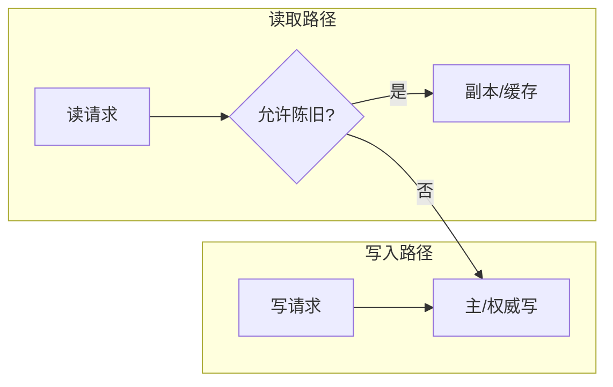
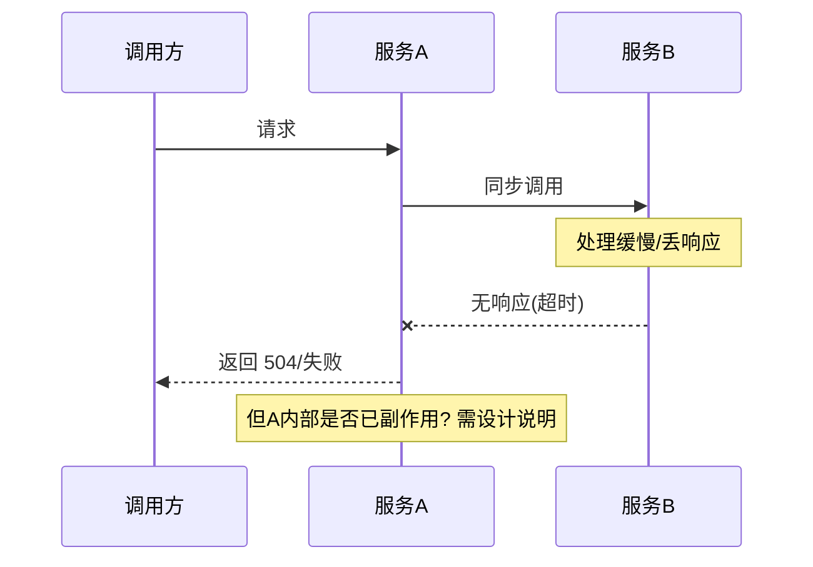

# 阶段 1：分布式心智模型与故障优先设计

> 与 [`ROADMAP.md`](../ROADMAP.md) 阶段 1 对齐。动手印证见本目录 [`demo/README.md`](demo/README.md)。**生成说明**：推荐阅读链接于文稿撰写日检索官网入口；后续请以各官方文档为准。

本阶段要做的事，可以压缩成一句：**先学会用「会坏」的眼睛看系统**，再谈选型与组件。许多团队把分布式讨论成「上不上微服务、用不用某某中间件」，却少有人先把 **一致性级别、故障类型、超时与重试的语义** 写成团队共识；于是线上问题常以「级联超时」「重复扣款」「锁丢了还以为互斥」等形式爆发。下面按路线把 **CAP 的工程取景框、故障模型、不确定性、Java 并发的本地边界、分布式锁的 trade-off** 串成一条可读链条；文中会多次回到同一条纪律：**先声明业务能接受的语义与最坏影响面，再选手段**。

## 本阶段知识地图

| 块 | 你要带走的抓手 |
|----|----------------|
| 一 | 用「业务语义 ↔ 一致性级别」翻译 CAP，而不是背三选二 |
| 二 | 崩溃 / 遗漏 / 拜占庭 三类故障与 **部分失败** 的画法 |
| 三 | 超时是 **不确定性** 的预算；重试是有前提的放大器 |
| 四 | 线程池、`CompletableFuture`、原子与锁：**只保证进程内** |
| 五 | 分布式锁是 **事故热点**；优先幂等、串行热点、队列、协调服务边界 |

**路线要点 ↔ 本文章节**

| `ROADMAP.md` 阶段 1 要点 | 本文展开位置 |
|--------------------------|----------------|
| CAP **实务**；线性 / 顺序 / 最终一致 | **一** |
| 故障模型：崩溃、遗漏、拜占庭；与超时/重试/幂等对照 | **二** |
| 不确定性与超时；组织默认值 | **三** |
| Java 并发最小集；**本地幻觉** | **四** |
| 分布式锁陷阱（Redis / ZK·etcd 类 / DB） | **五** |
| 实践：部分失败草图；并发 `demo/` | **二、四** 与 [`demo/`](demo/) |

---

## 一、CAP 与一致性级别：把「定理」放回工程取景框

分布式系统里最常见的误用之一，是把 CAP 当成「三选二单选题」并在架构评审里用一句「我们选 AP」结束战斗。事实上，CAP 讨论的是 **网络分区发生时**，系统在 **一致性（C）** 与 **可用性（A）** 之间的权衡取向；它既不覆盖你日常最关心的全部语义细节，也不替你回答「这笔订单在延迟与资损窗口上到底能接受什么」。因此更实用的姿势是：**把 CAP 当作取景框**——用来暴露「分区出现时，你准备牺牲哪类用户体验、保留哪类不变式」，而不是当作口号。

**知识点（对应本节）**

| # | 知识点 | 抓住什么 |
|---|--------|-----------|
| 1 | **分区（Partition）** | 不是「偶尔慢」，而是**脑裂式**的通信断裂：两边都可能继续做事 |
| 2 | **线性一致（可线性化）** | 全局好像**只有一个时钟顺序**的读写；代价高、延迟敏感 |
| 3 | **顺序一致 / 因果** | 比线性弱一档的排序约束；仍要回答「谁看见谁的因」 |
| 4 | **最终一致** | 允许窗口；**必须**能说出窗口内用户/对账看到什么 |
| 5 | **CAP 的工程化** | 分区下「拒绝部分请求保真」vs「返回可能旧数据保活」的**显式产品决策** |

### 为什么争论焦点往往是「业务语义」而不是字母

**本块结论。** 架构师的工作不是替 CAP 投票，而是把 **读写路径上的保证** 翻译成产品能听懂的后果。例如「库存展示」与「库存扣减」对一致性的要求通常不同：展示短暂旧值往往可接受，扣减与支付状态机若出现双扣则直接资损。若团队把二者混在同一条「最终一致」话术下，就会在事故后才发现：**没人写过窗口内的用户可见规则与对账补偿**。因此评审里应强制出现三类信息：**读写各自的一致性级别**、**跨边界协作的残余风险**、**可观测与回滚抓手**；CAP 只帮助你定位「分区来了站哪边」，不替你写这三类信息。

### 一致性级别：命名要对齐到「谁、何时、读到什么」

**本块结论。** 「强一致」在不同上下文可能指线性一致、串行化隔离、或仅仅是「读主库」；若不在文档里消歧，工程实现会漂移。建议在团队内用一张小表固定 **读者角色 × 路径 × 允许陈旧度 × 对账机制**，而不是泛用形容词。下表是示意（数值需按业务改写，勿照抄为默认值）。

| 读场景 | 典型一致性取向 | 失败时的用户感知 | 常见工程映射（示意） |
|--------|----------------|-------------------|----------------------|
| 用户主路径展示 | 可短暂旧 | 刷新后纠正 | 缓存 + TTL；明确「非实时」 |
| 账务/库存扣减 | 强约束不变式 | 失败宁可拒服 | 单写者、串行热点、事务边界内 |
| 运营后台报表 | 可延迟 | 时间戳滞后 | 异步聚合、批处理 |

上图意在强调：**不是「有没有缓存」**，而是读路径是否**显式**分流到允许陈旧的存储。图后收束一句：一旦允许陈旧，就要配套 **版本、对账、用户提示或重试策略**，否则「最终一致」只是甩锅词。

---

**本节提要（延伸学习）**

- **核心概念**：网络分区；线性一致；最终一致与**显式窗口**；CAP 作为取景框而非口号
- **拓展提问提示词**

> 主题：Java 互联网业务中的 CAP 与一致性级别工程化。核心概念：网络分区、线性一致、最终一致、读写路径分流。请拓展：任选「库存展示」「库存扣减」「用户余额」三类场景之一，写出分区发生时你倾向保 C 还是保 A 的产品理由，给出读写各自一致性级别、残余不一致窗口、对账与观测手段，并说明若选错字母组合在生产中会呈现何种事故征象。期望产出：一页 ADR 风格的决策摘要（含否决的备选方案）。

---

## 二、故障模型与部分失败：先画「怎么坏」再画「怎么快」

若阶段 1 只记一个习惯，建议记 **故障优先**：默认进程会挂、包会丢、响应会 hang 到超时；在此前提下再问「功能是否仍安全、影响面是否可接受、我们能否观测与止血」。这与单机开发里「能跑通 happy path」的直觉相反，却是分布式架构师的默认操作系统。路线中的故障三分法——**崩溃故障、遗漏故障、拜占庭故障**——不是为了背定义，而是为了在评审时快速对齐 **我们默认敌人有多强**。

**知识点（对应本节）**

| # | 知识点 | 抓住什么 |
|---|--------|-----------|
| 1 | **崩溃故障** | 节点宕机、进程退出；表现为**突然静默** |
| 2 | **遗漏故障** | 丢包、超时、hang；**收不到应答 ≠ 没发生** |
| 3 | **拜占庭故障** | 任意错误甚至恶意；多数互联网后端**默认不防** |
| 4 | **部分失败** | 调用链上一截成功一截失败；最忌当成整体回滚幻觉 |
| 5 | **blast radius** | 最坏影响面；与舱壁、隔离、降级预案一起写 |

### 从「崩溃」到「遗漏」：为什么超时属于遗漏类直觉

**本块结论。** 崩溃故障相对好画：服务挂了，连接断开，调用方很快得到失败。更阴间的是遗漏类：**请求在路上丢、响应在路上丢、服务端卡住直到调用方超时**。对调用方而言，这三种情况常常**不可区分**，于是你必须按「最坏可能」设计——例如写库可能已经发生。后续阶段会展开幂等与对账；此处只建立 **语义锚点**：**超时是一种判定机制，不是事实探针**。若在文档里写「我们设置 3 秒超时所以不会出问题」，属于范畴错误。

### 拜占庭边界：何时需要抬高假设

**本块结论。** 多数数据中心内的服务间调用默认 **非拜占庭**：相信对方进程不是恶意篡改，只处理宕机、丢包、软件 bug 导致的错误结果。若场景跨强信任域（例如开放互联网上的客户端、部分区块链相邻系统），才需要讨论更强的校验、审计与抗抵赖。评审里常见错误是 **为内部服务堆叠密码学式假设** 却忽视 **简单的超时与幂等缺失**；先修后者往往更划算。

### 部分失败与影响面：用序列图强迫诚实

**本块结论。** 画「部分成功」比画 happy path 更有价值：网关成功、下游 A 成功写库、下游 B 超时——此时用户看到什么？能否重试？重试会不会双写？下图是极简示意，你可把参与者换成自己的网关、订单、库存、消息。

图读后请回答三个问题：**哪一步可能已发生副作用**、**用户重试是否安全**、**运维如何确认卡在何处**；答不上来则不应进入扩容或换中间件讨论。

---

**本节提要（延伸学习）**

- **核心概念**：崩溃故障；遗漏故障；拜占庭边界；部分失败；blast radius
- **拓展提问提示词**

> 主题：分布式系统故障模型与部分失败分析。核心概念：崩溃故障、遗漏故障、拜占庭故障、部分失败、blast radius。请拓展：以你熟悉的一条三跳同步链路为例，画出包含超时与一次重试的时序图，标出每一步可能已发生的副作用，写出若不做幂等/对账会出现的业务事故，并给出把 blast radius 收窄到单上下文内的两条工程手段与一条组织手段（如评审清单项）。期望产出：序列图说明 + 半页风险说明。

---

## 三、不确定性与超时：默认值是风险预算，不是性能旋钮

超时、重试、退避在工程里常被当成「调优参数」，但在架构语义里，它们首先是 **对不确定性的预算**：你愿意等多久来区分「慢」与「死」，以及你愿意承担多大的 **重试放大** 与 **重复副作用** 风险。组织若不给默认值，各服务会把超时抄成互不一致的数字，于是最外层用户请求可能早已失败，内层还在层层等待——典型的 **超时链吞噬**。

**知识点（对应本节）**

| # | 知识点 | 抓住什么 |
|---|--------|-----------|
| 1 | **超时链** | 端到端预算 = 各跳预算 + 排队；内层须小于外层 |
| 2 | **重试前提** | 仅对**幂等**或**安全层**重试；忌对未知写路径无脑重试 |
| 3 | **jitter** | 打散同步重试尖峰，减轻「惊群」 |
| 4 | **组织默认值** | 文档化：典型同步链、异步链、批处理各自的默认与例外审批 |
| 5 | **可观测** | 超时率、重试率、尾延迟与下游饱和度联动看 |

### 超时链：从「单点配置」到「预算表」

**本块结论。** 建议把超时从「每个 client 一个魔法数」提升为 **预算表**：列出用户请求入口 SLA、关键依赖、允许排队深度，再反推每跳上限。表中应显式写出：**哪一跳允许失败返回缓存**、**哪一跳必须 fail-fast**；否则运维在事故中只能盲调数字。此处不展开具体框架配置，记住原则即可：**外层应最先耗尽预算**，避免用户已走，内层仍占用线程与连接。

### 重试：默认敌人是「重复」与「风暴」

**本块结论。** 遗漏类故障迫使你可能重试；但重试把「单次不确定」变成「多次叠加」。若写路径未幂等，重试等价于**随机双写**；若下游已过载，重试风暴等价于**自我 DDoS**。因此团队级默认应是：**先证明幂等或引入幂等键，再打开重试**；并配合上限、退避与抖动。与路线自查句对齐：当你想加「自动重试三次」，先回答 **最坏会多写几次**。

---

**本节提要（延伸学习）**

- **核心概念**：不确定性；超时链；重试前提；jitter；组织默认值
- **拓展提问提示词**

> 主题：分布式调用中的超时链与重试治理。核心概念：超时链、遗漏故障、幂等、重试风暴、jitter。请拓展：给定一个入口 P99 目标与三条同步依赖，设计一张超时预算表（含每跳上限与失败策略），并说明若第二条依赖在故障注入下延迟翻倍，系统应在哪一层快速失败以保护第三条与线程池；同时写出禁止重试的写路径反例与可重试的读路径正例。期望产出：预算表 + 八条以内的团队默认值草案。

---

## 四、Java 并发最小集与「本地幻觉」：`demo/` 能看见什么

路线要求掌握 **线程池、`CompletableFuture`、共享状态陷阱**，目的不是背诵 API，而是建立 **边界感**：这些机制解决的是 **同一进程地址空间内** 的可见性、原子性与生命周期问题。把它们误当成「我已经处理了并发」并推广到跨服务，就是 **本地幻觉**。典型症状包括：在每台机器上各加一把 `synchronized` 以为全局互斥、把 `volatile` 当分布式缓存一致性、把「Future 完成」当成「远程写未发生」。

**知识点（对应本节）**

| # | 知识点 | 抓住什么 |
|---|--------|-----------|
| 1 | **线程池** | 隔离、队列与饱和策略决定**延迟形态** |
| 2 | **`CompletableFuture`** | 组合异步；**超时 ≠ 取消远程副作用** |
| 3 | **竞态与原子** | `long++` 非原子；`Atomic*` 与锁的取舍在**进程内** |
| 4 | **本地幻觉** | 本地正确性 **不蕴含** 跨 JVM 互斥或一致 |
| 5 | **与后续阶段衔接** | 真正跨边界靠契约、幂等、消息语义、协调服务 |

### 线程池：先当「舱壁」理解，再当「性能」理解

**本块结论。** 线程池把任务执行与资源上限绑在一起；池满时的拒绝或排队策略，会直接把延迟从「正常」推向「排队雪崩」。在分布式视角里，这对应 **舱壁**：不让一个慢依赖拖光所有 worker。阶段 1 只需记住：**池子不是越大越好**；没有超时与背压配合的大池，只是把故障推迟到更不可读的形式。

### `CompletableFuture` 与超时：对照「调用方视角」与「事实发生」

**本块结论。** `orTimeout`、`get(timeout)` 等让调用方**停止等待**，但**不自动撤销**另一线程里已启动的副作用，更不保证远程服务停止处理。这与第二节遗漏故障对齐：线上「客户端超时重发」与「服务端实际已执行」并存是常态。请运行 [`demo/README.md`](demo/README.md) 中的 `CompletableFutureTimeoutDemo`，观察场景 A 的打印顺序，再把现象翻译成一句架构陈述：**对外承诺的超时，要配套幂等与可观测，而不是假设超时能抹掉写操作**。

### 竞态演示：为什么「加锁正确」仍不等于「分布式互斥」

`RaceConditionDemo` 对比三种计数器：**非原子 `long`**、`synchronized`、`AtomicLong`。你会看到非原子版本在并发下稳定丢更新；后两者在单 JVM 内收敛到期望值。实验后请做一道思想实验：若两个 JVM 各跑一个进程，各有一个 `SyncCounter`，同一时刻各 increment 一次，全局计数是否仍为 2？答案是否定的——于是引出阶段 5 的真正工具箱：**分布式协调、幂等键、数据库唯一约束、业务串行热点** 等，而不是再复制一把 `synchronized`。

---

**本节提要（延伸学习）**

- **核心概念**：线程池；CompletableFuture；竞态与原子；本地幻觉；超时与取消的语义边界
- **拓展提问提示词**

> 主题：Java 并发与分布式心智的边界。核心概念：线程池、CompletableFuture、竞态、synchronized、AtomicLong、本地幻觉。请拓展：结合 `RaceConditionDemo` 与 `CompletableFutureTimeoutDemo` 的现象，写一段说明解释「为何 JVM 内互斥无法替代跨服务互斥」，并给出三种不依赖分布式锁而降低写冲突的工程手段（如幂等键、唯一约束、队列单消费者），各附一句适用前提与反例。期望产出：不少于 400 字的技术说明 + 每条手段一行反例。

---

## 五、分布式锁：事故热点与「最后手段」纪律

路线把分布式锁单列为 **高发事故点**，因为它极易与单机锁直觉混淆：看起来都是「互斥」，但语义依赖 **租约、时钟、主从复制、会话与 fencing** 等一整束假设。Redis 单实例、主从切换、Redlock 争论、ZooKeeper / etcd 会话锁、数据库悲观/乐观锁——**没有银弹**，只有「在明确假设下可辩护」的选择。阶段 1 的纪律建议写成一句团队口号：**分布式锁往往是最后手段**；优先追问「能否用幂等、串行化热点、聚合不变式、队列单消费者解决问题」。

**知识点（对应本节）**

| # | 知识点 | 抓住什么 |
|---|--------|-----------|
| 1 | **租约 + 过期** | 过期太短易误释放；太长易长时间互斥 |
| 2 | **误删他人锁** | 释放须校验 token；Lua 脚本原子校验+删除 |
| 3 | **主从漂移** | 主宕未复制锁到从，晋升后互斥可能破裂 |
| 4 | **ZK / etcd 类** | 会话与临时节点；运维与延迟模型与 Redis 不同 |
| 5 | **DB 锁与版本** | 乐观锁、悲观锁、唯一约束常更简单可观测 |
| 6 | **最后手段** | 锁扩大故障面；优先幂等与队列 |

### Redis 路径：先理解「假设集合」再抄命令

**本块结论。** 官方文档对分布式锁模式有系统阐述（含安全与活性讨论）。你需要带着问题阅读：**我的 Redis 拓扑是单主还是从？** **时钟skew 与租约长度谁兜底？** **业务是否能在锁丢失后继续安全运行（幂等）？** 若回答含糊，锁会变成「表面互斥、实际双写」的隐患源。Redlock 等方案是否在你们拓扑下成立，应作为 **ADR 单独论证**，而不是依赖社区口水。

### ZK / etcd 类：协调强一致与运维复杂度

**本块结论。** ZooKeeper 食谱与 etcd 的 API 保证文档，帮助你把讨论从「调客户端」提升到 **协调服务的线性一致/会话语义**。它们在某些场景优于 Redis 锁，但引入 **运维与延迟** 成本；评审要问：**团队是否能承担协调集群的可用性与升级窗口**。若不能，则「业务幂等 + 队列」可能更诚实。

### 数据库与业务层：很多「抢锁」应改为「抢唯一键」

**本块结论。** 在单库或明确分片键内，**唯一约束 + 重试友好错误** 往往比分布式锁更易观测、更易教新人理解。乐观锁版本号适合读多写少冲突概率低的聚合根。把这条与 DDD 后续阶段衔接：**锁应靠近不变式与事务边界**，而不是在网络各处撒「看起来互斥」的 Redis key。

---

**本节提要（延伸学习）**

- **核心概念**：租约；token 校验释放；主从复制与锁语义；ZK·etcd 协调语义；DB 乐观/悲观/唯一约束；最后手段
- **拓展提问提示词**

> 主题：分布式锁的 trade-off 与替代方案。核心概念：Redis 分布式锁、租约、主从切换、ZooKeeper 食谱锁、etcd API 保证、数据库唯一约束、幂等。请拓展：选一个「库存扣减」或「优惠券领取」场景，分别给出基于 Redis 锁、基于 DB 唯一约束、基于队列单消费者三种实现的语义假设、残余风险、可观测指标与回滚方式；最后写清在什么证据下你会在 ADR 中否决分布式锁方案。期望产出：对比表 + 一段 ADR 结论草案。

---

## 推荐阅读

说明写在链接前；**链接行仅 URL**，便于复制。

- **Oracle Java SE — Concurrency 教程**
  - 与本阶段：建立线程、同步、监视器与 `java.util.concurrent` 的**官方语境**，对照本文「本地边界」。
  - https://docs.oracle.com/en/java/javase/21/core/concurrency.html
  - 检索：`Oracle Java SE 21 concurrency tutorial`

- **Oracle Java SE 21 — `java.util.concurrent` 包概览**
  - 与本阶段：线程池、`ExecutorService`、`Future` 等 API 的权威说明，支撑 `demo` 中线程与任务模型。
  - https://docs.oracle.com/en/java/javase/21/docs/api/java.base/java/util/concurrent/package-summary.html
  - 检索：`java.util.concurrent package-summary Java SE 21`

- **《Designing Data-Intensive Applications》（DDIA）— 作者站点**
  - 与本阶段：可靠性、复制、一致性与分布式权衡的**概念底盘**；与路线「弱化中间件手册、强化 trade-off」一致。
  - https://dataintensive.net/
  - 检索：`Designing Data-Intensive Applications Martin Kleppmann`

- **Redis 官方文档 — Distributed locks with Redis**
  - 与本阶段：分布式锁**语义、风险与模式**（非命令大全）；支撑第五节讨论。
  - https://redis.io/docs/latest/develop/clients/patterns/distributed-locks/
  - 检索：`Redis distributed locks official documentation`

- **Apache ZooKeeper — Recipes and Solutions**
  - 与本阶段：基于协调服务的锁与羊群效应等**经典构造**；对照 Redis 路径的假设差异。
  - https://zookeeper.apache.org/doc/current/recipes.html
  - 检索：`Apache ZooKeeper recipes distributed lock`

- **etcd 文档 — API guarantees**
  - 与本阶段：理解强一致协调存储的 **API 级保证**，与业务层幂等配合阅读。
  - https://etcd.io/docs/latest/learning/api/
  - 检索：`etcd API guarantees linearizability`
