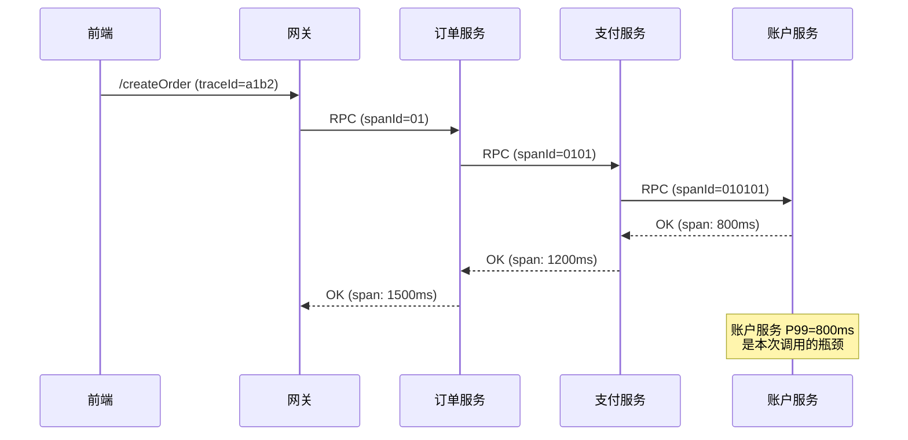

# 阶段 5：可观测、容量与稳定性治理

> 与 [`ROADMAP.md`](../ROADMAP.md) 阶段 5 对齐。动手印证见本目录 [`demo/README.md`](demo/README.md)。**生成说明**：推荐阅读链接基于官方文档入口撰写；组件与默认值持续演进，**请以官方文档与团队规范为准**。

阶段 4 处理了数据侧的经典问题——缓存一致性、事务模式选型、分库分表决策。阶段 5 转向**运维侧**：如何知道系统正在发生什么、即将发生什么、以及何时必须介入。三个能力缺一不可：**可观测**（看得见链路）、**容量**（知道极限在哪里）、**稳定性治理**（基于可观测数据做决策）。本章的核心不是教你配监控仪表盘，而是让你在故障时能说："P99 超了，错误预算还剩 X%，当前降级策略是 Y，应优先保护核心链路 Z。"

## 本阶段知识地图

| 块 | 你要带走的抓手 |
|----|----------------|
| 一 | 可观测三根（Trace/指标/日志）与关联价值——**无关联的日志等于废铁** |
| 二 | 黄金信号 + RED/USE 两大框架——一个服务只需要盯 4~6 个核心指标 |
| 三 | 压测解读：P99 与饱和度的业务含义——**不是数字难看就要扩容** |
| 四 | SLO + 错误预算 → 告警阈值——用消耗速率而非固定阈值驱动告警 |
| 五 | 告警治理：降噪与可信——**告警不是越多越好，能行动的才是好告警** |

**路线要点 ↔ 本文章节**

| `ROADMAP.md` 阶段 5 要点 | 本文展开位置 |
|--------------------------|----------------|
| 日志关联、黄金信号、Tracing | **一** |
| 压测解读（P99、饱和度） | **二 + 三** |
| 限流降级与 SLO | **四** |
| 告警治理（降噪与可信） | **五** |
| 与错误预算对齐的限流降级 | **四 + 五** |

---

## 一、可观测三根：Trace、指标、日志的分工与关联

可观测性（Observability）不是"有没有监控"的问题，而是"能不能从任意一个异常点反推出完整的影响面"。分布式系统的故障往往是跨服务传播的——订单服务超时 → 前端重试 → 支付服务被打爆 → 账户服务雪崩。如果每个服务的监控是孤立的，你能看到"账户服务 P99 爆炸"，但无法回答"是谁把它打爆的"。可观测性解决的正是这个问题。

**可观测性的三根支柱：**

| 类型 | 本质 | 代表工具 | 典型用途 |
|------|------|---------|---------|
| **Trace（链路追踪）** | 单次请求在多个服务间的完整路径 | SkyWalking、Jaeger、Zipkin | 定位慢请求的瓶颈在哪一段、定位级联故障的源头 |
| **指标（Metrics）** | 聚合后的数值（N 次请求的统计量） | Prometheus + Grafana、云 APM | 判断整体健康趋势、驱动告警与 SLO 报表 |
| **日志（Logs）** | 离散事件，结构化或非结构化文本 | ELK/Loki + Grafana、云日志服务 | 根因分析、审计、合规 |

**关键认知：三根不是独立的，是要关联的。** 没有 Trace 的日志是乱码（你知道出了错但不知道哪次请求触发的）；没有指标的 Trace 是盲测（你知道链路长什么样但不知道有多严重）；没有日志的指标是猜谜（你知道 P99 超了但不知道根因是什么）。

### 1.1 Trace 的核心价值：定位级联故障的源头

链路追踪解决的核心问题是：**分布式系统中，一次请求跨越多个服务，如何判断哪个服务是罪魁祸首？**

以 OpenTracing / OpenTelemetry 为标准的 Trace 模型：一次请求生成一个全局唯一的 `traceId`，在每个服务入口/出口通过 SDK 注入/传递 `spanId`。每个 span 记录：服务名、操作名、耗时、标签（tags）、事件（events）。



图中可见：账户服务的 span 耗时 800ms 是整个链路 1500ms 的主要贡献者。如果只看整体 P99，你只知道"订单服务很慢"；有了 Trace，你能定位"账户服务是瓶颈"。

**SkyWalking 是国内互联网最常用的 Trace 实现**：基于 Java Agent 的零侵人接入、UI 层面的拓扑自动绘制、告警规则与 Trace 直接关联。缺点是 UI 的交互体验不如 Jaeger，适合查询但不适合探索式分析。

### 1.2 指标的本质：聚合后的数值，用于趋势判断与告警驱动

指标不是"每秒多少条日志"，而是**一段时间窗口内的聚合统计**——QPS、平均响应时间、P99 响应时间、CPU 使用率、GC 频率。指标的存储引擎（如 Prometheus 的 TSDB）专为高基数时间序列设计，查询效率远超从日志中统计。

**指标的设计原则：**

1. **名即语义**：指标名应自解释，如 `order_service_api_create_order_latency_p99`。避免 `metric_123` 这种无名指标。
2. **标签（Labels）用于维度切分**：`status=success/fail`、`instance=172.16.1.1`、`version=2.1.3`。同指标名 + 不同标签 = 不同时间线。
3. **Cardinality 控制**：高基数标签（如 userId、requestId）不适合直接作 Prometheus label，会导致序列爆炸。用采样或预聚合解决。

**指标与 Trace 的协作模式**：

- **指标发现问题**：`order_service_p99 > 2000ms` → 触发告警。
- **Trace 定位根因**：点进告警关联的 Trace 面板，找到慢 span 的具体服务与代码位置。
- **日志验证假设**：找到可疑日志行，验证是 GC pause 还是慢查询还是网络抖动。

这个闭环（指标 → Trace → 日志）是可观测性的核心工作流。

### 1.3 日志的定位：根因分析与审计

日志是三根中**最原始、最详细、但关联成本最高**的。对可观测性的贡献主要是：

- **根因分析**：从 Trace 定位到可疑服务后，拉该服务的日志找到具体错误栈（OOM、连接池耗尽、非法参数）。
- **审计与合规**：金融、电商的敏感操作（付款、退款、权限变更）需要留痕，日志是法定义务。
- **安全分析**：异常 IP、暴力破解、权限提升——需要结构化日志 + SIEM 对接。

**结构化日志的必要性**：JSON 格式的结构化日志比文本日志更容易被解析和检索。每个日志行应包含：`timestamp`、`level`、`service`、`traceId`、`spanId`、`message`、`context（业务相关字段）`。非结构化日志在大流量下几乎不可检索。

**日志与 Trace 的关联**：最关键的是 `traceId` 必须在日志中透传。从请求入口打 log 时注入 `traceId`，后续所有子服务/中间件的日志都应继承这个 ID。这是"日志关联"的基础设施要求——没有 Trace ID 的日志无法与 Trace 面板关联。

---

**本节提要（延伸学习）**

- **核心概念**：可观测三根（Trace/指标/日志）分工与关联、OpenTelemetry traceId/spanId 模型、SkyWalking 零侵人 Java Agent、日志结构化与 traceId 透传、指标 Cardinality 控制
- **拓展提问提示词**

> 主题：分布式系统可观测性三根支柱的工程落地与关联实践。核心概念：OpenTelemetry traceId/spanId 传播模型、SkyWalking vs Jaeger 的场景差异、结构化日志 JSON vs text 的取舍、日志 traceId 透传的上下文传播机制、指标 Cardinality 爆炸的防控（预聚合/Sampling）。请拓展：OpenTelemetry SDK 在 Spring Boot 中的集成（OTLP Exporter 配置）；SkyWalking Lua Agent 对 Nginx 层 tracing 的支持；日志聚合与实时搜索的性能成本（Loki vs Elasticsearch）；SLO 对应的指标选择（可用率/响应延迟/吞吐量）及其计算公式。产出格式：三根协作工作流图 + SkyWalking/Otel 配置要点 + 2 条以上生产故障定位案例。

---

## 二、黄金信号与两大框架：RED 与 USE

可观测性的核心挑战不是"收集什么数据"，而是**收集了数据之后谁能看懂**。黄金信号（Golden Signals）是 Google SRE 提出的一个框架：**任何服务，不管多复杂，只需要盯住 4~6 个核心指标**，就能判断健康状态。这 4~6 个指标就是"黄金信号"。

### 2.1 黄金信号：四到六个核心指标

| 信号 | 指标定义 | 业务含义 | 常见工具标签 |
|------|---------|---------|-------------|
| **延迟（Latency）** | 请求响应时间分布（P50/P90/P99） | 用户是否在等 | `http_server_requests_seconds` |
| **流量（Traffic）** | QPS / TPS / 并发连接数 | 系统是否在负载下 | `http_server_requests_total` |
| **错误（Errors）** | 错误率（4xx/5xx/业务异常） | 是否有请求失败了 | `http_server_requests_total{status="5xx"}` |
| **饱和度（Saturation）** | CPU/内存/连接池/队列深度 | 系统还有多少余量 | `jvm_memory_used_bytes`, `hikaricp_connections_active` |

Saturation 是最容易被忽视的——当 Latency 上升但 CPU 还很低，往往是**队列积压**（等待线程池或连接池）而非计算瓶颈。队列积压的代价是延迟成倍增长（后面的请求在排队），但 CPU 看起来正常。

### 2.2 RED 框架：面向用户请求的服务指标

**RED = Rate（请求率）、Errors（错误率）、Duration（延迟分布）**。适合无状态服务（HTTP/RPC）：这类服务的核心价值是"处理了多少请求、出错了多少、耗时多少"。

```
Rate:  curl -s prometheus:9090/api/v1/query?query=http_server_requests_total | jq '.data.result[].value[1]'
Errors: curl -s prometheus:9090/api/v1/query?query=rate(http_server_requests_total{status=~"5.."}[5m])
Duration: curl -s prometheus:9090/api/v1/query?query=histogram_quantile(0.99, rate(http_server_requests_seconds_bucket[5m]))
```

### 2.3 USE 框架：面向资源（硬件/中间件）的指标

**USE = Utilization（利用率）、Saturation（饱和度）、Errors（错误）**。适合基础设施（数据库、缓存、队列）：这类组件的核心价值是"有没有在干活、干得多满、有没有故障"。

| 资源 | USE 指标 |
|------|---------|
| CPU | Utilization = `system_cpu_usage`；Saturation = `system_load1`（Load Average） |
| 内存 | Utilization = `jvm_memory_used / jvm_memory_max`；Saturation = GC 频率与耗时 |
| 数据库 | Utilization = `innodb_buffer_pool_usage`；Saturation = `active_connections / max_connections` |
| Redis | Utilization = `used_memory / maxmemory`；Saturation = `command_latency_p99` |

**两个框架怎么用**：

- **用户视角（面向服务）→ RED**：问"用户请求成功了吗、延迟如何"。
- **运维视角（面向资源）→ USE**：问"基础设施是否健康、瓶颈在哪"。
- 两者互补：RED 告诉你"有没有问题"，USE 告诉你"问题在哪里"。

### 2.4 指标选择的两条原则

1. **选 P99 而非平均值**：平均值容易被极端值掩盖。P99（99 分位）告诉你"最差的 1% 请求有多慢"——这才是用户体验的真实反映。业务 SLA 通常基于 P99 或 P99.9。
2. **选有上下文的比率而非绝对值**：错误率（5xx / 总请求）比 5xx 数量更有意义——流量下降时绝对值下降不代表健康。利用率（CPU_used / CPU_max）比原始使用量更能判断是否需要扩容。

---

**本节提要（延伸学习）**

- **核心概念**：黄金信号（延迟/流量/错误/饱和度）、RED 框架（Rate/Errors/Duration）用于无状态服务、USE 框架（Utilization/Saturation/Errors）用于基础设施、P99 vs 平均值、比率指标 vs 绝对值
- **拓展提问提示词**

> 主题：黄金信号（Golden Signals）与 RED/USE 两大框架在微服务监控中的工程落地。核心概念：延迟 P99 与业务 SLA 对齐、饱和度与队列积压的关联（Load Average vs CPU）、RED 用于 HTTP/RPC 服务、USE 用于 DB/Redis/MQ 等基础设施、指标命名规范（service_operation_labels）。请拓展：Prometheus Histogram 与 Summary 的选择（预计算分位 vs 客户端计算）；Micrometer 与 Spring Boot Actuator 的指标暴露集成；饱和度指标的"逼近阈值"设计（告警在 80% 触发还是 95%）；Kubernetes 环境下的 USE 指标（Pod 资源限制 vs 实际使用量）。产出格式：两类框架的指标选择决策表 + Prometheus PromQL 示例 + Grafana Dashboard 布局建议。

---

## 三、压测解读：P99、饱和度与容量规划

可观测让你知道系统现在怎么样，容量规划让你知道系统**即将**怎么样。压测（Load Test / Stress Test）是容量规划的核心手段——但压测数据如果读错了，比不测还危险。

### 3.1 压测类型与目标

| 类型 | 目标 | 典型指标 |
|------|------|---------|
| **基准测试（Benchmark）** | 单机/单服务最大 QPS | 极限 TPS、响应时间基准线 |
| **负载测试（Load Test）** | 正常流量下的表现 | P99 延迟、错误率、吞吐量 |
| **浸泡测试（Soak Test）** | 长时间稳定运行 | 内存泄漏、连接池耗尽、指标漂移 |
| **峰值测试（Spike Test）** | 突发流量冲击 | 能否扛住尖峰、恢复时间 |
| **压力测试（Stress Test）** | 超出设计容量的表现 | 崩溃点、优雅降级能力 |

### 3.2 P99 的业务含义：不是数字，是用户体验

**P99 = 99% 的请求响应时间低于此值。** 例如 P99 = 500ms 意味着：每 100 次请求中，有 99 次低于 500ms，有 1 次高于 500ms。

- **为什么用 P99 而不是平均值**：平均值容易被"大量快速请求 + 少量极慢请求"拉偏。P99 更接近"最差用户体验"的真实反映。
- **P99 与 SLA 的关系**：如果 SLA 承诺 99.9% 的请求在 200ms 内完成，你的 P99 必须在 200ms 以内。SLA 是商业承诺，P99 是技术实现。
- **P99 怎么看**：在 Prometheus 中用 `histogram_quantile(0.99, rate(http_request_duration_seconds_bucket[5m]))`。注意：histogram_quantile 需要足够的 buckets（一般设 10~20 个 bucket，边界如 10ms/50ms/100ms/200ms/500ms/1s）才能准确。

### 3.3 饱和度判断：谁先成为瓶颈

压测过程中的饱和度判断是关键。**不是 CPU 先到 100% 才叫饱和——连接池、线程池、队列、磁盘 IO 都可能先饱和。**

```
症状：延迟上升，但 CPU 不高
→ 可能是：连接池耗尽（数据库连接数上限）、线程池排队、JVM GC 频繁（内存分配压力）、下游依赖限流
→ 排查：看 hikaricp_active_connections、tomcat_threads_current、jvm_gc_pause、http_client_requests_rejected
```

```
症状：QPS 上不去，延迟稳定
→ 可能是：已经达到极限（受限于线程池大小、连接池大小、数据库单表 QPS）
→ 排查：对比基准测试的极限值，当前 QPS 是否接近基准
```

### 3.4 容量规划：从压测数据到扩缩容决策

容量规划的目标是回答：**需要多少台机器、每个组件的瓶颈在哪、什么时候需要扩容**。

**核心公式（简化的排队论）**：

```
理论最大 QPS = 线程数 / 平均响应时间 (秒)

例如：200 线程池、平均响应时间 100ms → 理论最大 QPS = 200 / 0.1 = 2000 QPS
```

但这只是单服务理论值。实际压测需要验证：

1. **每层链路的瓶颈**：网关 / 业务服务 / 数据库 / 缓存，哪个先成为瓶颈？
2. **瓶颈的饱和路径**：数据库 CPU 100% 还是连接池先满？
3. **扩容收益**：加机器后 QPS 是否线性提升？瓶颈是否会转移？

**扩缩容决策表**：

| P99 延迟 | 饱和度 | 决策 |
|---------|--------|------|
| < SLA | < 70% | 正常，不扩容 |
| < SLA | 70~85% | 关注，准备扩容 |
| < SLA | > 85% | 立即扩容（预防峰值） |
| > SLA | 任意 | 紧急扩容 + 降级 |

---

**本节提要（延伸学习）**

- **核心概念**：压测五类型（基准/负载/浸泡/峰值/压力）、P99 与 SLA 对齐、histogram_quantile 与 bucket 设计、饱和度判断（连接池/线程池/JVM GC）、排队论简化为扩缩容决策表
- **拓展提问提示词**

> 主题：压测方法论与容量规划的工程实践。核心概念：压测五类型与目标、Prometheus histogram_quantile P99 计算与 bucket 设计原则、饱和度判断（CPU vs 连接池 vs GC vs 下游限流排队）、排队论简化公式（线程数/平均响应时间）与理论 QPS、扩缩容决策表与安全余量设计。请拓展：Gatling/JMeter 压测脚本的 TPS 与响应时间双维度配置；链路压测（全链路 mock vs 影子流量）与瓶颈定位；K8s HPA 基于 Prometheus 指标的自动扩缩容配置；数据库单表 QPS 瓶颈与水平扩容的边界（分库分表的提前触发点）。产出格式：压测报告模板（基线/峰值/瓶颈/scaling 建议）+ Prometheus 指标选取决策 + 容量规划 Excel/工具链推荐。

---

## 四、SLO 与错误预算：从业务承诺到告警阈值

SLO（Service Level Objective）是业务对用户的**承诺**——"我们保证 99.9% 的请求在 200ms 内完成"。错误预算（Error Budget）是**允许消耗的失败配额**——"99.9% 意味着每月 0.1% 的失败请求是可以接受的"。这两个概念把"技术指标"变成了"业务决策"的依据。

### 4.1 SLO 的制定：从业务约束出发

SLO 不是"技术团队觉得应该多少"，而是"业务允许用户多久体验一次差劲"。制定流程：

```
业务约束（用户容忍度）→ 技术实现（当前能达到多少）→ SLO 承诺（两者取保守值）→ 告警阈值（错误预算消耗速率）
```

**常见的 SLO 设定**：

| 服务类型 | 可用率 SLO | 延迟 SLO | 典型场景 |
|----------|-----------|---------|---------|
| 核心交易（支付、订单） | 99.9%（月 43 分钟） | P99 < 200ms | 金融级，错误预算极小 |
| 主要业务（商品、用户） | 99.5%（月 3.6 小时） | P99 < 500ms | 电商主流，平衡成本与体验 |
| 非核心（通知、推荐） | 99%（月 7 小时） | P99 < 2s | 可接受更大波动，降级优先 |

### 4.2 错误预算：消耗速率驱动告警

**错误预算 = (1 - SLO) × 总请求数**。例如：SLO = 99.9%，本月预计 1 亿请求 → 错误预算 = 1000 次失败。

**告警阈值不应基于固定百分比（如"错误率 > 1% 就告警"），而应基于错误预算的消耗速率：**

| 消耗速率 | 告警级别 | 含义 |
|---------|---------|------|
| **1 小时内消耗 1 天的预算** | P1 紧急 | 问题在快速恶化，必须立即处理 |
| **1 天内消耗 1 周的预算** | P2 重要 | 趋势不可接受，需安排人力处理 |
| **1 周内消耗 1 个月的预算** | P3 观察 | 可接受但需关注，防止继续恶化 |

这个逻辑的好处是：**告警的紧迫性与业务影响挂钩**，而非与技术指标挂钩。"错误率 2%"在 QPS 低的时段可能是正常的，在大促期间就是灾难性的。

**错误预算监控的 Prometheus 表达式**：

```promql
# 过去 1 小时错误数
sum(increase(http_server_requests_total{status=~"5.."}[1h]))

# 错误预算消耗速率（小时维度）
# 假设 SLO = 99.9%，月度预算 = 0.001 × 月请求数，月度错误预算 / 720（小时）
```

### 4.3 基于 SLO 的降级策略

当错误预算消耗过快时，降级策略是"保核心弃非核心"：

| 场景 | 降级策略 | 判定条件 |
|------|---------|---------|
| 支付链路繁忙 | 关闭非核心服务调用（推荐、积分），保护支付 | 支付服务 P99 > 500ms |
| 推荐服务超时 | 返回默认推荐结果（兜底数据），不阻塞主流程 | 推荐 P99 > 2s 或错误率 > 5% |
| 库存查询压力 | 限流 + 返回"库存充足"兜底，支付时再校验 | 库存服务 CPU > 80% |

**降级策略必须与 SLO 对齐**：核心链路（支付）的降级优先级最高，非核心链路（推荐）可以被降级。降级决策应提前写成配置（开关 + 阈值），而不是在故障时现场改代码。

---

**本节提要（延伸学习）**

- **核心概念**：SLO 从业务约束到技术承诺的制定流程、错误预算（Error Budget）的计算与消耗速率、速率驱动告警（1h消耗1天预算 = P1）、降级策略与 SLO 对齐（核心 vs 非核心）、开关配置化与提前预案
- **拓展提问提示词**

> 主题：SLO 与错误预算的制定方法论与告警驱动实践。核心概念：SLO 三要素（可用率/延迟/吞吐量）的业务约束推导、错误预算计算公式与月度/周度分解、速率驱动告警的三个级别（P1/P2/P3）与预算消耗挂钩、Prometheus 错误预算监控表达式、基于 SLO 的降级策略决策树与开关配置化。请拓展：SLO 多维度设定（可用率 + 延迟 + 数据准确性）；错误预算消耗后"烧完"的操作指南（紧急修复 vs 接受降级 vs 暂停发布）；Google SRE Book 中 Error Budget Policy 的编写模板；SLO 追踪工具（Sloth、Prometheus SLO 导出器）与管理层报表。产出格式：SLO 制定工作流 + 错误预算计算器 + 速率告警 Prometheus 表达式 + 降级策略配置模板。

---

## 五、告警治理：降噪与可信

可观测性的最常见失败不是"没有数据"，而是**数据太多、噪声太大、告警疲劳**。一个真实的 SRE 团队每天可能收到几百条告警，其中 90% 是"有意义但不需要立即处理"的噪声。告警疲劳的代价是：当真正的 P1 告警来临时，值班人员已经麻木了。告警治理的目标是：**让每条告警都是可行动的。**

### 5.1 告警质量的两条准则

| 准则 | 内容 | 反例 |
|------|------|------|
| **可行动** | 收到告警后，下一步操作是明确的 | "CPU 99%"（没有说明要做什么） |
| **紧急性分级** | P1 需要立即处理，P2 需要当日处理，P3 可排期 | 所有告警都标 P1 |
| **避免噪声** | 抖动、瞬时毛刺、测试环境不应触发生产告警 | 毛刺告警（30s 内自动恢复的 CPU 尖峰） |

### 5.2 降噪手段

**1. 动态基线**：固定阈值（`CPU > 80%`）无法适应业务周期——白天流量高峰期 CPU 80% 可能是正常的，凌晨可能是故障。用动态基线（基于历史同期数据）替代固定阈值。例如：工作日 10:00~22:00 基线 75%，凌晨 00:00~06:00 基线 30%。

**2. 维护窗口**：发布/升级期间的服务抖动不应触发告警。在告警规则中配置维护窗口（如 `maintenance_window=true` 标签的实例暂时抑制告警）。

**3. 聚合与抑制**：同一根因的多个告警应聚合为一条。例如：`order-service-pod-1 CPU 高`、`order-service-pod-2 CPU 高`、`order-service-pod-3 CPU 高` → 聚合为 `order-service CPU 高（3/10 pods）`。如果上游服务已经告警，下游服务可以抑制（避免重复告警）。

**4. 升级路径**：P1 告警超过 X 分钟未确认 → 自动升级（通知值班经理、触发应急群）。避免"等人来处理"的被动等待。

### 5.3 告警规则设计模板

每条告警规则应包含：

```
名称：order_service_p99_latency_slo_breach
条件：histogram_quantile(0.99, rate(http_server_requests_seconds_bucket{service="order"}[5m])) > 0.5 AND
      sum(rate(http_server_requests_total{service="order", status="5xx"}[5m])) / sum(rate(http_server_requests_total{service="order"}[5m])) > 0.01
for: 5m
标签：severity=p2, team=order-platform, slo=order_latency
注释：
  - 描述：订单服务 P99 延迟超过 500ms 或错误率超过 1%，持续 5 分钟
  - 操作：① 查看 SkyWalking 链路追踪定位慢请求；② 检查下游依赖（支付、库存）；③ 如是数据库瓶颈，检查慢查询；④ 如超时来源不明，注入故障隔离
```

### 5.4 告警盘点：季度评审与误报修复

**每季度进行一次告警规则评审**：删除长期静音的告警、合并重复告警、调整不合理的阈值。误报（False Positive）必须修复——每条误报都在消耗值班人员的注意力，降低团队对告警系统的信任。

---

**本节提要（延伸学习）**

- **核心概念**：告警质量两条准则（可行动 + 紧急性分级）、动态基线 vs 固定阈值、维护窗口与发布期抑制、告警聚合与同源抑制、升级路径（P1 超时未确认自动升级）、告警规则设计模板（条件/for/标签/注释）、季度告警盘点
- **拓展提问提示词**

> 主题：告警治理体系与降噪实战。核心概念：告警疲劳的代价与"可行动"准测、动态基线（基于历史同期的自适应阈值）、维护窗口与发布期告警抑制、同源聚合与上下抑制、升级路径与值班联动机制、告警规则设计模板（含操作注释）、季度告警盘点与误报修复。请拓展：Prometheus AlertManager 的抑制规则（inhibit_rules）与路由配置；值班飞书/钉钉机器人与告警分级路由；误报分析工具（告警时序聚类、基线偏差检测）；SLO 告警 vs 资源告警的优先级设计（前者优先于 CPU/内存告警）。产出格式：告警规则评审清单 + AlertManager 配置示例 + 降噪前后对比案例 + 值班 SOP 模板。

---

## 推荐阅读

> 说明在前、链接行仅 URL（复制时不会夹带额外字符）。

- **Google SRE Book — Chapter 6: Embracing Risk**
  - 关联主题：错误预算与 SLO 制定的核心参考，理解"可用率不是越高越好"的成本逻辑。
  - https://sre.google/sre-book/embracing-risk/
  - 检索：`Google SRE error budget SLO risk management`

- **SkyWalking 官方文档**
  - 关联主题：Java Agent 零侵人接入、链路追踪 UI 使用、告警规则配置。
  - https://skywalking.apache.org/docs/main/latest/en/setup/service-agent/java-agent/readme/
  - 检索：`Apache SkyWalking Java agent tracing`

- **OpenTelemetry 官方文档**
  - 关联主题：traceId/spanId 模型、OTLP 协议、SDK 与 Collector 部署。
  - https://opentelemetry.io/docs/
  - 检索：`OpenTelemetry SDK Java trace`

- **Prometheus 官方文档 — Alerting**
  - 关联主题：AlertManager 路由、抑制、聚合配置，PromQL 告警规则编写。
  - https://prometheus.io/docs/alerting/latest/alertmanager/
  - 检索：`Prometheus AlertManager inhibit silence route`

- **Grafana Dashboard 最佳实践**
  - 关联主题：黄金信号 Dashboard 布局、RED/USE 框架的可视化。
  - https://grafana.com/docs/grafana/latest/dashboards/
  - 检索：`Grafana dashboard best practices golden signals`

- **Microservices.io — Patterns: Observability**
  - 关联主题：分布式追踪模式的工程化参考。
  - https://microservices.io/patterns/observability/
  - 检索：`microservices observability patterns distributed tracing`