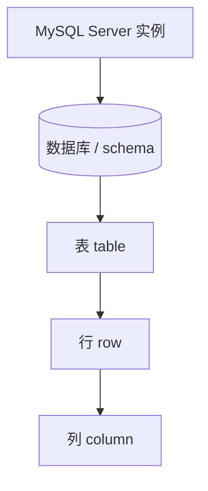

# 阶段：安装与环境 · 库表与基础 SQL — 理论知识

## 本阶段学习目标

与 [`ROADMAP.md`](../ROADMAP.md) 中阶段 1 对齐，学完本阶段你应能够：

- 在本机或容器中获得可连接的 **MySQL 服务端**，并用命令行或图形工具完成登录。
- 用自己的话说明 **实例（服务器进程）**、**数据库（schema）**、**表**、**行/列** 的包含关系。
- 使用 **DDL** 创建数据库与简单表；使用 **DML** 完成增删改查。
- 编写带 **`WHERE`** 条件、**`ORDER BY`** 排序、**`LIMIT`** 分页的查询，并理解常见运算符与 `NULL` 处理要点。

动手顺序与示例文件见本目录 [`demo/README.md`](./demo/README.md)。

## 核心概念与知识图谱



- **实例**：通常指一台机器上运行的一个 `mysqld` 进程及其监听端口、配置与数据目录；一个实例可承载多个数据库。
- **数据库**：逻辑上的命名空间，内部包含多张表与其他对象；连接后需 **`USE 库名`** 或 **限定表名**（`库名.表名`）来定位。
- **表**：按列定义结构，按行存储记录；关系型数据库的核心存储单元。
- **SQL 分类（入门常用）**：
  - **DDL**（Data Definition Language）：`CREATE`/`ALTER`/`DROP` 等，定义结构。
  - **DML**（Data Manipulation Language）：`SELECT`/`INSERT`/`UPDATE`/`DELETE`，操作数据。
  - **DCL**（Data Control Language）：授权相关（阶段 5 再系统学）。

## 安装与连接：你需要建立的心智模型

### 服务端与客户端分离

日常说的「装 MySQL」通常包含两部分：

1. **服务端（Server）**：真正存数据、执行 SQL 的进程。
2. **客户端（Client）**：向服务端发 SQL 并展示结果的工具，例如 **`mysql` 命令行**、MySQL Shell、Workbench、DBeaver、DataGrip 等。

学习阶段建议至少掌握一种 **官方命令行客户端**，便于复现实验与查阅手册中的示例。

### Windows 安装提示（摘要）

在 Windows 上常见做法是使用官方安装包（MSI），按向导完成实例初始化并记下 **root 密码** 与 **端口**（默认 3306）。若安装程序提供 **MySQL Configurator**，可在图形界面中调整基本参数。具体步骤与前置依赖（如运行库）以官方「在 Microsoft Windows 上安装 MySQL」章节为准（见文末推荐阅读）。

### 可选：用 Docker 快速起实例

若你不希望把 MySQL 直接装在系统里，可用容器拉起一个临时实例，端口映射到本机后，客户端连接方式与物理安装类似。本阶段 `demo/` 提供了可选的 `docker-compose.yml`，详见 [`demo/README.md`](./demo/README.md)。

## `mysql` 客户端入门

连接成功后，你会看到 `mysql>` 提示符。常用 **非 SQL** 命令包括：

- **`\\c` 或 `CTRL+C`**：取消当前正在输入的一行（习惯因客户端而异）。
- **`USE db_name;`**：切换默认数据库。
- **`SHOW DATABASES;`**、**`SHOW TABLES;`**：浏览库与表（元数据查询）。

SQL 语句通常以 **`;`** 结束。建议养成：**一条业务 SQL 写完整再执行**，复杂查询先在小表上验证。

## 建库与建表（DDL 入门）

### `CREATE DATABASE`

创建逻辑库，并可指定默认字符集与排序规则（深入放到阶段 2；阶段 1 先会用即可）。

```sql
CREATE DATABASE IF NOT EXISTS study_mysql_stage01
  DEFAULT CHARACTER SET utf8mb4;
```

### `CREATE TABLE`

列定义包含：**名称**、**数据类型**、**是否允许 NULL**、**默认值**、**约束**（主键等）。阶段 1 先掌握 **`INT`**、**`VARCHAR(n)`**、**`DATETIME`**、**`DECIMAL(p,s)`** 的常见用途即可。

```sql
CREATE TABLE IF NOT EXISTS product (
  id            BIGINT UNSIGNED NOT NULL AUTO_INCREMENT,
  name          VARCHAR(128) NOT NULL,
  price_cents   INT UNSIGNED NOT NULL DEFAULT 0,
  created_at    DATETIME NOT NULL DEFAULT CURRENT_TIMESTAMP,
  PRIMARY KEY (id)
) ENGINE=InnoDB;
```

- **`AUTO_INCREMENT`**：由服务器自动分配递增主键值（典型用法与 **`PRIMARY KEY`** 同列搭配）。
- **`ENGINE=InnoDB`**：MySQL 默认的事务型引擎（阶段 4、5 会再展开）；阶段 1 先保持习惯写法。

## 基础 DML：CRUD

### 插入：`INSERT`

常用两种形式：**按列顺序插入值**，或 **显式列出列名**（推荐后者，可读性与演进更好）。

```sql
INSERT INTO product (name, price_cents) VALUES ('Notebook', 1999);
```

### 查询：`SELECT`

最基本结构：**投影列 → 数据来源 → 过滤 → 排序 → 分页**。

```sql
SELECT id, name, price_cents
FROM product
WHERE price_cents >= 1000
ORDER BY created_at DESC
LIMIT 10;
```

### 更新：`UPDATE`（务必带 `WHERE`）

没有 **`WHERE`** 的更新往往会作用于全表，属于高危操作；练习库中也应刻意避免。

```sql
UPDATE product
SET price_cents = 2099
WHERE id = 1;
```

### 删除：`DELETE`（务必带 `WHERE`）

同理，删除若无条件可能清空整张表；生产环境常与备份、权限与审计联动。

```sql
DELETE FROM product WHERE id = 1;
```

## `WHERE`：条件组合与 `NULL`

### 常用运算符

- **比较**：`=`, `<>`, `<`, `>`, `<=`, `>=`
- **范围**：`BETWEEN ... AND ...`
- **集合**：`IN (...)`，`NOT IN (...)`
- **模糊**：`LIKE`，搭配 `%`、`_` 通配符
- **逻辑**：`AND`，`OR`，`NOT`（复杂条件建议加括号明确优先级）

### `NULL` 的特殊性

**`NULL` 表示未知**，不是字符串 `'NULL'`。比较时使用 **`IS NULL`** / **`IS NOT NULL`**；常用函数如 **`COALESCE(a, b)`** 可在值为 `NULL` 时回退到备选表达式。

错误示例：`WHERE col = NULL` 通常不会按直觉匹配行；应写 `WHERE col IS NULL`。

## `ORDER BY` 与 `LIMIT`（分页直觉）

- **`ORDER BY col [ASC|DESC]`**：`ASC` 升序可省略；多列排序时依次写 `ORDER BY a DESC, b ASC`。
- **`LIMIT row_count`**：限制返回行数；分页常见写法 **`LIMIT offset, row_count`** 或配合 **`LIMIT row_count OFFSET offset`**（风格择一，团队统一即可）。

数据量大时，无序查询配合 **`LIMIT`** 可能每次返回不同“前几行”（若无稳定排序键）；业务分页通常需要 **确定排序键**（例如主键或创建时间）。

## 与下一阶段的衔接

- 阶段 2 将系统讲 **数据类型选择**、**约束** 与 **索引** 如何影响查询与存储。
- 本阶段只需建立：**表结构合理即可练习 SQL**，不要过早优化；先跑通正确性与可读性。

## 常见误区与注意点

- **误区**：「连上数据库」等于「会 SQL」——连接只是环境；能否写出可靠查询取决于对 **`WHERE`**、**`NULL`** 与语义的理解。
- **误区**：把 **`SELECT *`** 当作习惯——学习前期可以，生产查询应只取必要列，减少 IO 与耦合。
- **注意**：更新/删除类语句在实验库中也应用 **`WHERE`** 约束范围，避免养成坏习惯。
- **注意**：字符集与排序规则引发的中文排序/索引问题，阶段 2、6 会再展开；阶段 1 建议统一使用 **`utf8mb4`** 创建练习库。

## 自检清单

- [ ] 能独立启动/连接 MySQL，并说明端口、用户名、密码在连接字符串中的作用。
- [ ] 能解释 **实例 / 库 / 表 / 行 / 列** 的关系，并正确使用 **`USE`** 或 **`库.表`**。
- [ ] 能写出 **`CREATE DATABASE`**、**`CREATE TABLE`**（含主键与 **`AUTO_INCREMENT`**）的最小可用示例。
- [ ] 能完成 **`INSERT`/`UPDATE`/`DELETE`/`SELECT`**，且更新与删除始终带合理 **`WHERE`**。
- [ ] 能使用 **`AND`/`OR`**、**`LIKE`**、**`BETWEEN`**、**`IN`**，并正确处理 **`NULL`**。
- [ ] 能使用 **`ORDER BY`** 与 **`LIMIT`** 完成排序与简单分页。

## 推荐阅读与扩展资料

以下链接在撰写时经检索核对，指向 MySQL 手册入口或常用章节；若日后路径变更，请以 [MySQL 文档门户](https://dev.mysql.com/doc/) 顶部导航重新检索。

- **MySQL 8.4 Reference Manual（总入口）** — https://dev.mysql.com/doc/refman/en/index.html（对照你所安装版本打开对应手册）
- **Installing MySQL（安装总览）** — https://dev.mysql.com/doc/en/installing.html（选择操作系统与安装形态）
- **Installing MySQL on Microsoft Windows** — https://dev.mysql.com/doc/refman/en/windows-installation.html（Windows 专用步骤）
- **Creating and Using a Database（建库、建表、基础查询入门）** — https://dev.mysql.com/doc/mysql/en/database-use.html（与官方教程路径一致）
- **Entering Queries** — https://dev.mysql.com/doc/en/entering-queries.html（客户端里执行语句的习惯）
- **SELECT Statement** — https://dev.mysql.com/doc/en/select.html（查询语句完整语法与子句说明）
- **INSERT Statement** — https://dev.mysql.com/doc/en/insert.html（插入语句各类写法）

**检索关键词（自助更新资料）**：`MySQL 8.4 Reference Manual`、`Installing MySQL`、`CREATE DATABASE`、`CREATE TABLE`、`SELECT`、`INSERT`、`WHERE NULL`、`ORDER BY LIMIT`。

## 本阶段理论知识小结

- 先把 **服务端 + 客户端** 跑通，理解连接信息与 **`USE`** 的作用。
- **DDL** 负责结构，**DML** 负责数据；本阶段掌握最小闭环：**建库表 → 插入 → 查询/更新/删除**。
- **`WHERE`** 决定“查哪部分行”，**`ORDER BY`** 决定顺序，**`LIMIT`** 控制返回规模；三者组合是日常最高频模式。
- **`NULL`** 不能用普通等号比较；更新/删除务必带 **`WHERE`**，从小养成安全习惯。
