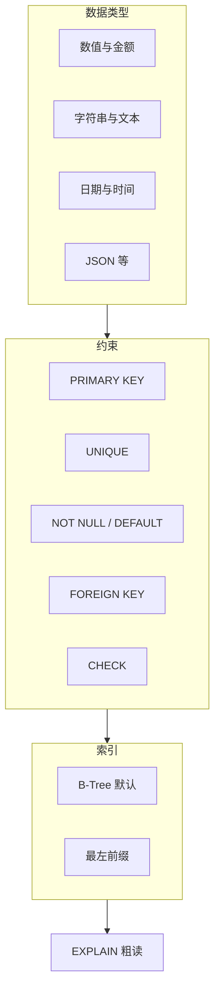

# 阶段：数据类型 · 约束 · 索引基础 — 理论知识

## 本阶段学习目标

与 [`ROADMAP.md`](../ROADMAP.md) 中阶段 2 对齐，学完你应能：

- 按业务场景选择合理的数值、字符串、日期时间与 JSON 类型，而不是一律 `VARCHAR`。
- 正确理解 `NULL` 在约束与比较中的含义，并能在表设计中体现是否允许为空、默认值如何配合。
- 使用 `PRIMARY KEY`、`UNIQUE`、`FOREIGN KEY`、`CHECK`（在版本支持的前提下）等约束保证数据一致性。
- 建立 B-Tree 索引的基本直觉：何时建单列索引、复合索引的「最左前缀」思路；能用 `EXPLAIN` 粗看查询是否可能用到索引（细节留到阶段 6）。

## 核心概念与知识图谱

## 核心概念（分节展开）

### 1. 为什么类型选型很重要

列类型决定：存储空间、合法取值范围、比较与排序规则、能否建某类索引、以及应用层与 SQL 交互时的精度（例如金额）。「全部 VARCHAR」会丧失类型约束、浪费索引效率，且容易在边界数据上出错。

**简要对照（直觉）**：

| 场景 | 常见选择 | 避免 |
|------|-----------|------|
| 整数计数、主键代理 | `INT` / `BIGINT`，必要时 `UNSIGNED` | 用 `DOUBLE` 存「看似整数」的累计值 |
| 金额 | `DECIMAL(p,s)` 或整数「分」 | `FLOAT` / `DOUBLE` 直接存元 |
| 变长文本 | `VARCHAR(n)`，`n` 为字节上限（与字符集有关） | 无上限的「万能 VARCHAR」 |
| 仅日期或仅时间 | `DATE`、`TIME` | 全部用字符串 |
| 需时区一致的时间点 | `TIMESTAMP`（注意会话时区）或应用层统一 UTC + `DATETIME` | 混用且不约定规则 |

### 2. 数值类型要点

- **整数**：`TINYINT` … `BIGINT`；`UNSIGNED` 扩大非负范围但与应用语言交互时注意溢出。
- **定点数 `DECIMAL(M,D)`**：金额与需要精确十进制的场景优先；`M` 为精度、`D` 为小数位。
- **浮点 `FLOAT`/`DOUBLE`**：近似值，不适合存储精确金额。

### 3. 字符串与字符集

- **`CHAR(n)`**：定长，适合长度稳定的编码类字段；短且长度固定时空间可预测。
- **`VARCHAR(n)`**：变长；`n` 在 InnoDB 中与「最大长度、是否可为 NULL、字符集」共同影响行格式与索引长度限制。
- **排序规则 `collation`**：影响比较、`ORDER BY`、唯一约束是否认为两个字符串相等；库/表/列可分层指定，设计阶段应统一策略（阶段 1 已用 `utf8mb4_unicode_ci` 作为示例）。

### 4. 日期与时间

- **`DATE` / `TIME` / `DATETIME` / `TIMESTAMP`**：`TIMESTAMP` 受 [MySQL 时区设置](https://dev.mysql.com/doc/refman/8.4/en/time-zone-support.html) 影响，跨应用时需格外约定；业务只需「墙上时钟」时可用 `DATETIME`。
- **分数秒**：`DATETIME(3)`、`TIMESTAMP(6)` 等 `fsp` 用于毫秒/微秒级需求。

### 5. `NULL` 的语义

- **`NULL` 表示未知**，不是「空字符串」也不是数值 0。
- 在 SQL 中：`expr = NULL` 不为真（需 `IS NULL` / `IS NOT NULL`）；聚合函数如 `COUNT(*)` 与 `COUNT(col)` 对 `NULL` 行为不同。
- 表设计上：**哪些列允许 NULL** 应反映业务「是否真的未知」；频繁参与搜索条件的列若允许 NULL，要注意查询条件写法与索引使用。

### 6. JSON 类型（可选能力）

MySQL 提供 `JSON` 类型及一组函数，适合「结构偶尔变化」的附属属性；核心交易字段仍宜用关系列建模，避免把所有字段塞进 JSON 导致约束弱、索引与查询成本高。

### 7. 约束：保证数据合法与关联一致

- **`PRIMARY KEY`**：每张表建议有明确主键；InnoDB 下聚簇索引即主键（概念层面了解即可）。
- **`UNIQUE`**：允许 `NULL` 时，多个 `NULL` 是否违反唯一与实现细节有关；业务唯一键建议配合 `NOT NULL`。
- **`FOREIGN KEY`**：要求被引用列在被引用表中有索引（通常为 `PRIMARY KEY` 或 `UNIQUE`）；删除/更新父行时可通过 `ON DELETE` / `ON UPDATE` 声明级联或限制策略。
- **`CHECK`**：MySQL 8.0.16 起对存储引擎支持检查约束（具体行为以官方手册为准）；用于「列值范围」「列间简单关系」类规则。

### 8. 索引基础与 B-Tree

InnoDB 默认索引为 **B-Tree**（手册中常写作 BTREE）。索引的作用是将「按某列（或多列）查找」从潜在的全表扫描变为更有序的查找路径。

- **单列索引**：适合频繁出现在 `WHERE` 等值条件或明确范围条件的列。
- **复合索引 `(a,b,c)`**：最左前缀原则——能有效支持「只用 a」「a+b」「a+b+c」一类前缀匹配模式；单独 `WHERE b = ?` 往往无法使用该复合索引（除非有优化器特例，不作为入门依赖）。
- **主键与二级索引**：入门阶段只需知道：查询若能走索引匹配，通常比全表扫描成本低（具体代价分析在阶段 6）。

### 9. 本阶段的 `EXPLAIN` 用法定位

本阶段目标：**看到 `type`、`key`、`rows` 等列，建立「有没有可能用到索引」的直觉**。不必深究所有输出列与优化器细节（阶段 6 展开）。

## 与上一阶段的衔接

阶段 1 你已能建库建表并写基础 CRUD。本阶段在同一实例上，把「列类型、约束、索引」从「会用」推进到「能选对、能解释为什么」；[`demo/`](./demo/) 中脚本与阶段 1 的 `study_mysql_stage01` 可并存，本阶段练习库名为 `study_mysql_stage02`。

## 与下一阶段的衔接

阶段 3 将大量使用多表查询与聚合；本阶段的类型与索引决策会直接影响 JOIN 与 `GROUP BY` 的可读性与性能感受。

## 常见误区与注意点

- 用浮点数存金额，导致对账误差。
- 认为「索引越多越好」——写入与维护成本会增加，且无效索引干扰优化器统计。
- 外键命名与引用列类型、长度、字符集不一致导致创建失败或隐式转换。
- 忽略 `collation` 不一致带来的「看起来相等却违反唯一」或排序异常。

## 自检清单

- [ ] 能说明为何金额优先 `DECIMAL` 或整数分，而不是 `DOUBLE`。
- [ ] 能写出含主键、唯一、非空、默认值、外键的 `CREATE TABLE` 草稿并解释各约束用途。
- [ ] 能解释复合索引的最左前缀，并据此设计一个简单的 `(a,b)` 索引。
- [ ] 能对一条 `SELECT` 执行 `EXPLAIN`，说出是否「大致」走了某个索引（知道 `type=ALL` 常表示全表扫描）。

## 推荐阅读与扩展资料

撰写本文时检索核对以下入口（请以当前手册版本为准）：

- **MySQL 8.4 Reference Manual — Chapter 13 Data Types** — https://dev.mysql.com/doc/refman/8.4/en/data-types.html（本阶段类型总览与分章入口）
- **MySQL 8.4 Reference Manual — CREATE TABLE** — https://dev.mysql.com/doc/refman/8.4/en/create-table.html（列定义、表选项与表内索引/约束）
- **MySQL 8.4 Reference Manual — CREATE INDEX** — https://dev.mysql.com/doc/refman/8.4/en/create-index.html（向已有表增加索引）
- **MySQL 8.4 Reference Manual — FOREIGN KEY Constraints** — https://dev.mysql.com/doc/refman/8.4/en/create-table-foreign-keys.html（外键语义与引用限制）
- **MySQL 8.4 Reference Manual — EXPLAIN** — https://dev.mysql.com/doc/refman/8.4/en/explain.html（执行计划入门，与本阶段「粗读」对应）

**检索关键词**：`MySQL 8.4 data types`、`MySQL CREATE TABLE`、`MySQL CREATE INDEX`、`MySQL foreign key`、`MySQL EXPLAIN`

## 本阶段理论知识小结

- 类型服务于精度、范围与查询模式；金额与标识符尤其要避免随手类型。
- 约束把业务规则推进数据库层，减少「只靠应用兜底」的风险。
- B-Tree 索引与最左前缀是后续优化课的底座；`EXPLAIN` 先建立直观感受即可。
