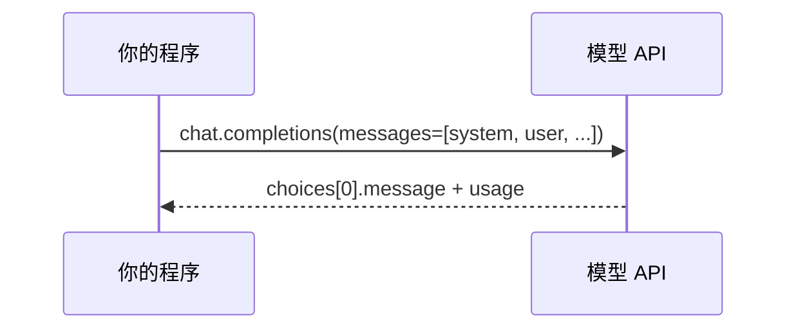

# 阶段：环境与 LLM 调用入门 — 理论知识

## 本阶段学习目标

与 [`ROADMAP.md`](../ROADMAP.md) 中阶段 1 对齐，学完本阶段你应能够：

- 使用 **虚拟环境** 隔离 Python 依赖，并在本机安装 `openai` 官方 SDK。
- 通过 **环境变量**（推荐配合 `.env`）管理 API Key，避免把密钥写入仓库。
- 发起一次 **`chat.completions`** 请求，理解 **`messages` 列表** 与常见 **角色（role）** 的含义。
- 区分 **`OpenAI`（同步）** 与 **`AsyncOpenAI`（异步）** 客户端的典型使用场景。
- 阅读响应中的 **`usage`**（若返回），建立 **token 数量与计费** 的粗粒度直觉。
- 识别若干常见 **HTTP/SDK 错误**，知道「何时值得重试、何时应修正请求」。

## 核心概念与知识图谱

```mermaid
flowchart TB
  subgraph env [运行环境]
    V[虚拟环境 venv]
    D[依赖 openai / python-dotenv]
  end
  subgraph cred [凭证]
    K[OPENAI_API_KEY]
    M[OPENAI_MODEL 可选]
  end
  subgraph call [一次调用]
    MS[messages: system / user / assistant]
    API[chat.completions.create]
    R[choices + usage]
  end
  V --> D
  K --> API
  MS --> API
  API --> R
```

## 核心概念（分节展开）

### Python 版本与虚拟环境

- **建议**：使用 **Python 3.10+**（官方 `openai` 包通常要求 **Python 3.9+**，新项目尽量选较新稳定版）。
- **虚拟环境**：用 `venv`（或 `conda`）为每个项目单独装依赖，避免全局污染、版本冲突。
- **依赖锁定**：团队场景可在后续引入 `pip-tools` / `uv` 等锁定版本；本阶段只需 `requirements.txt` 即可。

### API Key 与环境变量

- **不要在代码或 Git 中硬编码密钥**。泄露会导致账号被盗用与账单损失。
- **常见做法**：在操作系统或部署环境中设置 `OPENAI_API_KEY`；本地开发可将 `.env` 加入 **`.gitignore`**，用 `python-dotenv` 在运行时加载。
- **最小权限**：在平台控制台按需创建 Key、设置用量上限（若平台支持），并定期轮换。

### 一次「对话式」请求长什么样

面向聊天模型时，多数入门示例使用 **Chat Completions**（`client.chat.completions.create`）。请求体的核心是 **`messages`**：一个由多条字典组成的列表，每条包含：

| 字段 | 含义（直觉） |
|------|----------------|
| `role` | 谁在说话：`system`（系统/开发者指令）、`user`（用户）、`assistant`（模型上一轮回复）等；新模型族可能对角色名有扩展，**以官方文档为准**。 |
| `content` | 文本内容；多模态场景下可能是结构化内容，本阶段先掌握纯文本即可。 |

把 **历史多轮对话** 放进 `messages` 时，一般交替追加 `user` / `assistant`，从而在同一上下文窗口内维持连贯性（窗口长度上限由模型决定）。



### 同步客户端与异步客户端

| 类型 | 典型入口 | 适用场景 |
|------|-----------|----------|
| 同步 | `from openai import OpenAI` | 脚本、简单工具、Jupyter 单线程逻辑 |
| 异步 | `from openai import AsyncOpenAI` | Web 服务（FastAPI 等）、高并发 I/O、与其他 async 库组合 |

异步并非「更快 magically」，而是 **在同一进程内更好地并发等待网络 I/O**；CPU 密集任务仍需另外考虑进程/线程模型。

### Token 与用量字段 `usage`

- **Token** 是模型计费与上下文窗口的计量单位；中英文、标点都会被切成子词，**字数 ≠ token 数**。
- 若响应中包含 **`usage`**（如 `prompt_tokens`、`completion_tokens`、`total_tokens`），可用于估算单次调用成本与是否接近上下文上限。
- **定价与模型列表**以 OpenAI（或你所用平台）官网定价页为准，本笔记不写入具体价格数字以免过时。

### 错误类型与「重试」意识

常见情况（名称以 SDK/文档为准）：

- **401 / 认证失败**：Key 错误、过期、环境变量未加载——**应修配置，不要盲目重试**。
- **429 / 限流**：请求过于频繁——可 **退避重试**（指数退避），并降低并发。
- **5xx / 超时**：服务端或网络抖动——可 **有限次数重试**；同时设置合理 `timeout`。
- **400 / 参数错误**：模型名非法、`messages` 格式不对——**修正请求**，重试无意义。

生产环境可结合 Tenacity 等库做重试策略；本阶段在 `demo/` 中保持最小示例，重在建立概念。

### 与「Responses API」的关系（了解即可）

OpenAI 文档中会介绍较新的 **Responses** 等接口形态，部分新能力会以新 API 为主推进。**本路线阶段 1–4 的示例仍以 `chat.completions` 为主**，与大量教程、LangChain 入门路径一致。你在阅读官方「文本生成」指南时，可同时扫一眼 **Responses** 文档，避免未来迁移时陌生。

## 与上一阶段的衔接

本专题第一阶段，无前置阶段；默认你已具备基础 Python 语法与命令行使用能力。

## 与下一阶段的衔接

阶段 2 将在此之上讨论 **提示模板化、结构化输出、多轮状态管理**。完成本阶段后，你应能无障碍修改 `messages` 并观察模型输出变化。

## 常见误区与注意点

- **把 Key 提交到 Git**：务必检查 `.gitignore` 与仓库历史；若已泄露应立即在平台作废密钥并换新。
- **认为异步一定更快**：异步利于并发等待；单次脚本若顺序执行，同步往往更简单。
- **忽略 `model` 参数**：不同模型能力与价格差异大，应通过配置切换而非写死在多处。
- **不看 `finish_reason`**：在调试时，`stop` / `length` 等有助于判断是否被长度截断。

## 自检清单

- [ ] 能在新目录下创建 venv 并 `pip install -r requirements.txt` 成功。
- [ ] 能说明 `system` 与 `user` 在 `messages` 中的分工。
- [ ] 能运行同步与异步两个 demo，并说出异步适用的一种场景。
- [ ] 能在响应中找到助手回复文本；若存在 `usage`，能读出三类 token 字段含义。
- [ ] 能区分「该修 Key」与「该退避重试」两类错误。

## 推荐阅读与扩展资料

撰写本文时通过检索核对的 **官方入口**（若链接变更，请用检索关键词自行更新）：

- **开发者快速开始（Python）** — [https://platform.openai.com/docs/quickstart?context=python](https://platform.openai.com/docs/quickstart?context=python)（从零配置到首次调用）
- **Python API 库参考（总览）** — [https://developers.openai.com/api/reference/python](https://developers.openai.com/api/reference/python)（SDK 能力与类型说明入口）
- **文本生成指南 — Chat Completions（Python）** — [https://platform.openai.com/docs/guides/text-generation/chat-completions-api?lang=python](https://platform.openai.com/docs/guides/text-generation/chat-completions-api?lang=python)（对话范式与参数）
- **创建聊天补全（HTTP 参考，含 Python 示例）** — [https://platform.openai.com/docs/api-reference/chat/create?lang=python](https://platform.openai.com/docs/api-reference/chat/create?lang=python)（请求/响应字段查阅）

**检索关键词（便于日后自助查找）**：`OpenAI Python SDK`、`OPENAI_API_KEY`、`chat.completions`、`AsyncOpenAI`、`Chat Completions`、`prompt_tokens`、`openai-python GitHub`

## 本阶段理论知识小结

- 用虚拟环境与 `.env` 把「可复现实验」与「密钥安全」做对。
- **`messages` + `chat.completions`** 是入门最常用的调用骨架。
- **同步 / 异步** 按运行场景选型：脚本同步、服务异步。
- **usage / finish_reason** 是调试与成本意识的抓手。
- 官方文档随版本更新最快，模型名与接口以文档为准。
