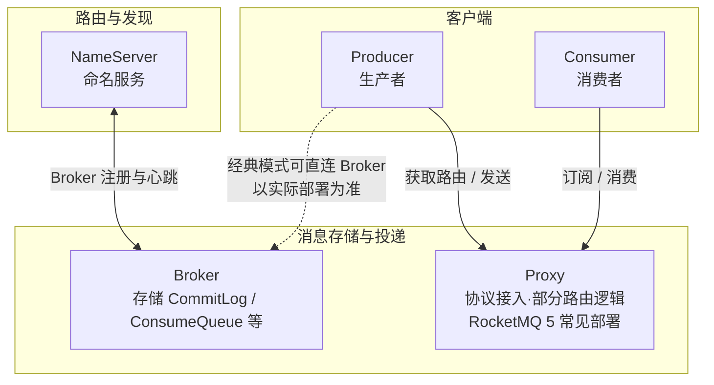
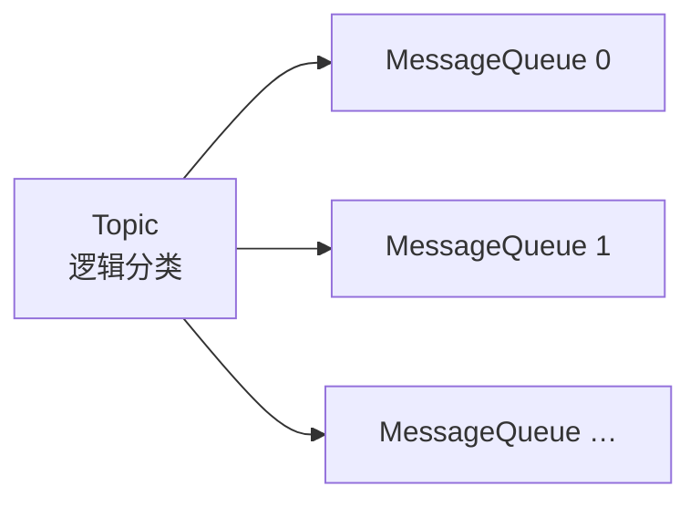

# 阶段：架构入门与本地运行 — 理论知识

## 本阶段学习目标

- 能说清楚 RocketMQ 在本地的最小拓扑：**NameServer**、**Broker**（及 RocketMQ 5 引入的 **Proxy**）各自做什么。
- 理解 **Topic**、**MessageQueue（队列）**、**生产者 / 消费者 / 消费者分组** 的关系，并能对照控制台或日志辨认路由是否正常。
- 能在本机用 **Docker**（推荐）或官网二进制方式拉起环境，**创建 Topic**，并用客户端完成一次「发送 → 投递 → 确认消费」闭环。
- 知道 RocketMQ 5.x 与 4.x 在部署形态上的一处关键差异：**启用 Proxy 时，客户端通常连接 Proxy 端点**，而非直连 Broker 的旧习惯（具体以官方文档为准）。

## 目录

- [本阶段学习目标](#本阶段学习目标)
- [RocketMQ 解决什么问题](#rocketmq-解决什么问题)
- [核心组件与拓扑](#核心组件与拓扑)
- [领域模型：从 Topic 到队列](#领域模型从-topic-到队列)
- [RocketMQ 5：Broker 与 Proxy](#rocketmq-5broker-与-proxy)
- [本地运行的最小闭环](#本地运行的最小闭环)
- [日志与常见故障直觉](#日志与常见故障直觉)
- [与下一阶段的衔接](#与下一阶段的衔接)
- [常见误区与注意点](#常见误区与注意点)
- [自检清单](#自检清单)
- [推荐阅读与扩展资料](#推荐阅读与扩展资料)
- [本阶段理论知识小结](#本阶段理论知识小结)

## RocketMQ 解决什么问题

在分布式系统中，两个服务如果**同步调用**，调用链会变长、故障会传导、峰值流量会直接压在下游数据库或核心接口上。**消息队列**把「请求–响应」改成「发送–异步处理」：生产者只需把事件投递到队列，消费者按自己的处理能力拉取或推送处理，从而实现：

- **异步解耦**：上下游不必同时在线、不必知道对方地址细节（由路由与 Topic 抽象）。
- **削峰填谷**：短时间突发写入队列，由消费者平滑消化。
- **最终一致与事件驱动**：业务状态变更以消息形式广播给多个订阅方（配合后续阶段的事务消息等能力）。

本阶段只建立「组件如何协作、消息如何落盘与投递」的直觉，不把顺序、事务等高级语义展开太深。

## 核心组件与拓扑

权威概念可参考官网中文文档 [基本概念](https://rocketmq.apache.org/zh/docs/introduction/02concepts)。

| 组件                    | 直觉职责                                                                                                                                                                                   |
| --------------------- | -------------------------------------------------------------------------------------------------------------------------------------------------------------------------------------- |
| **NameServer**        | **轻量、近似无状态**的路由目录服务。Broker 启动后向 NameServer **注册**自身负责的 Topic 路由；生产者与消费者先从 NameServer **查询** Topic 落在哪些 Broker、队列如何分布，再向目标 Broker（或 Proxy）发消息 / 拉消息。默认监听端口常见为 **9876**（以部署为准）。          |
| **Broker**            | **消息存储与投递**的实际节点：接收生产请求、持久化、维护消费进度、与高可用组件协作等。生产环境常为集群部署（主从、自动切换等，后续阶段展开）。                                                                                                              |
| **Proxy（RocketMQ 5）** | 将部分**面向客户端的协议与接入逻辑**从 Broker 中分离出来，便于弹性伸缩与云原生部署；官方 Docker Quick Start 常以 `**mqbroker --enable-proxy`** 方式一并启动 Broker 与 Proxy。客户端连接 **Proxy 暴露的 Endpoint（如 8080/8081）** 完成收发（见 `demo/`） |

读图要点：**NameServer 不负责存储消息**；消息生命周期主要在 **Broker**；客户端能否直连 Broker、是否必须经过 Proxy，取决于你的**集群版本与部署模式**，学习时以当前文档为准。

## 领域模型：从 Topic 到队列

仍建议对照官网 [基本概念](https://rocketmq.apache.org/zh/docs/introduction/02concepts) 阅读全文；此处抽取与本阶段强相关的几条。

- **Topic**：一类业务的**逻辑容器**（例如 `OrderPaid`）。RocketMQ 5 起对 **Topic 的消息类型**有更明确的校验与管理（普通 / 顺序 / 事务 / 定时等），便于运维治理。
- **MessageQueue（消息队列）**：Topic **物理拆分**的单位；消息实际落在某个队列上，队列上有**位点（Offset）**概念。横向扩展消费并行度时，常与队列规模、消费者实例数共同考虑。
- **生产者 / 消费者 / 消费者分组**：生产者负责发；消费者负责处理；**消费者分组（Consumer Group）是一组消费行为一致的消费实例的逻辑分组，用于负载均衡**与**消费进度（位点）**维度的管理。

这些名词会在阶段 2 的 API 与订阅关系中反复出现；本阶段只要能解释「Topic 为何对应多个队列」即可。

## RocketMQ 5：Broker 与 Proxy

RocketMQ 5 在架构上有「云原生化」演进：**存储（Broker）与接入（Proxy）可分开伸缩**。官方 [5.0 速览](https://rocketmq.apache.org/version) 说明了 5.x 相较 4.x 的差异方向（例如多语言 SDK、gRPC、Pop 消费等）。

对你当前学习的直接影响是：**复制官网 Docker 教程时，请使用文档给出的 `mqbroker --enable-proxy` 与 Endpoint（例如 `localhost:8081`）**，避免沿用旧教程里「只连 NameServer + 10911」的习惯而与本地实际端口不一致。

## 本地运行的最小闭环

官方推荐两条路径（撰写时已核对文档入口）：

1. **二进制本地运行**：[Run RocketMQ locally](https://rocketmq.apache.org/docs/quickStart/01quickstart/)
2. **Docker**： [Run RocketMQ in Docker](https://rocketmq.apache.org/docs/quickStart/02quickstartWithDocker/)

本仓库 `demo/` 以 **Docker Compose** 固化名称、网络与挂载，等价于文档中的 `docker run` 步骤，便于重复实验。

最小闭环检查清单：

1. NameServer 日志中出现 `**The Name Server boot success`** 一类成功标志。
2. Broker / Proxy 日志中出现 `**boot success`**（具体文件名可能是 `broker.log` / `proxy.log`，随镜像版本略有差异）。
3. 使用 `mqadmin` 或管控工具 **创建 Topic**（教程示例常为 `TestTopic`）。
4. 运行客户端：**发送一条消息 → 消费者打印消息 ID 或负载 → 返回消费成功**。

## 日志与常见故障直觉

本阶段不要求背诵参数，但建议养成习惯：

- **连不上**：优先核对 **Endpoint**（是否用了 Proxy 端口）、**防火墙 / 端口映射**、以及容器内 `**brokerIP1` / 监听地址** 是否与宿主机访问方式匹配（官网示例里常见 `brokerIP1=127.0.0.1`，适用于宿主机访问；远程访问需改为可达 IP，详见运维文档）。
- **能连但无路由**：NameServer 是否可见、Broker 是否注册成功、Topic 是否创建在与客户端一致的集群名上。
- **发送成功但消费不到**：订阅关系、Tag 过滤、消费者组是否与预期一致（深入在阶段 2）。

## 与下一阶段的衔接

下一阶段（**生产者与消费者开发基础**）将围绕 `**rocketmq-client-java` 的 API**、发送方式（同步 / 异步 / 单向）、**PushConsumer** 与订阅表达式展开。本阶段你只要跑通官方风格的客户端与端口模型即可。

## 常见误区与注意点

- **误以为 NameServer「转发消息」**：NameServer 主要维护路由元数据；消息内容不由 NameServer 持久化。
- **混淆「队列」与「Topic」**：Topic 是分类；队列是 Topic 下的分片与并行单位。
- **版本与端口混用**：同一仓库里尽量 **镜像标签、客户端依赖、文档章节** 对齐同一主版本族（如 5.x）；切换版本时优先重读对应版本的 Quick Start。
- **RocketMQ 5 Topic 消息类型**：新建 Topic 时注意选择与后续示例一致的消息类型（普通消息最常见）。

## 自检清单

- 能画出 NameServer、Broker、Proxy（若启用）、生产者、消费者之间的关系。
- 能用自己的话解释 Topic 为什么要分成多个 MessageQueue。
- 本地 Docker 环境可启动，并能完成 Topic 创建与一次收发验证。
- 知道去哪里查看 NameServer / Broker（及 Proxy）日志以判断启动是否成功。

## 推荐阅读与扩展资料

以下链接为撰写本文时核对的**官方网站入口**；若链接变更，请用检索关键词在官网重新定位。

- **[Run RocketMQ locally](https://rocketmq.apache.org/docs/quickStart/01quickstart/)** — 本地二进制快速入门，与本阶段「最小闭环」一致。
- **[Run RocketMQ in Docker](https://rocketmq.apache.org/docs/quickStart/02quickstartWithDocker/)** — 与本仓库 `demo/docker-compose.yml` 对应的官方 Docker 流程（含 Proxy 端口说明）。
- **[基本概念（中文）](https://rocketmq.apache.org/zh/docs/introduction/02concepts)** — Topic、MessageQueue、消费者分组等术语的官方定义。
- **[5.0 速览](https://rocketmq.apache.org/version)** — 了解 5.x 相对 4.x 的演进方向与术语背景。
- **[主题 Topic（中文）](https://rocketmq.apache.org/zh/docs/domainModel/02topic)** — Topic 模型细化阅读。
- **[消息队列 MessageQueue（中文）](https://rocketmq.apache.org/zh/docs/domainModel/03messagequeue)** — 队列与分片存储相关的官方说明。

**检索关键词（便于日后自行更新）**：`Apache RocketMQ quick start docker`、`rocketmq NameServer Broker`、`rocketmq proxy endpoint`、`mqadmin updatetopic`、`rocketmq-client-java 5`

## 本阶段理论知识小结

- RocketMQ 通过 **NameServer** 提供路由发现，通过 **Broker** 完成存储与投递；5.x 常见配合 **Proxy** 暴露客户端 Endpoint。
- **Topic** 下挂多个 **MessageQueue**，是并行与伸缩的基本结构。
- 本阶段目标是 **跑通部署与一次完整收发**；细节 API 与语义留在阶段 2。

