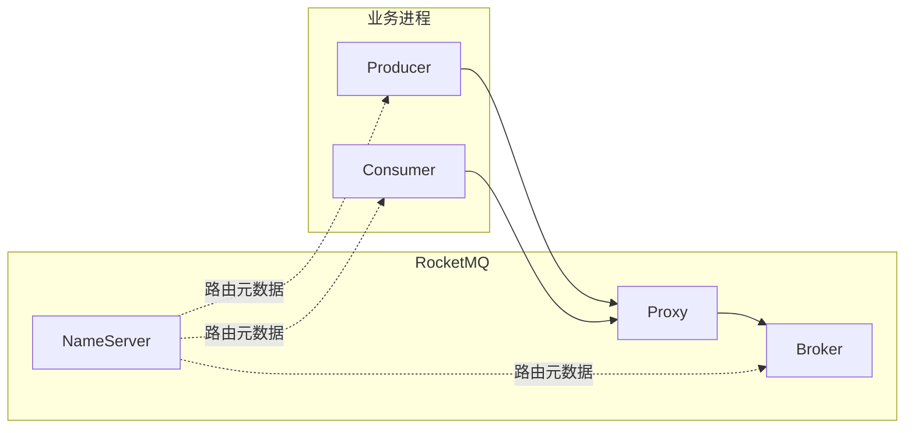
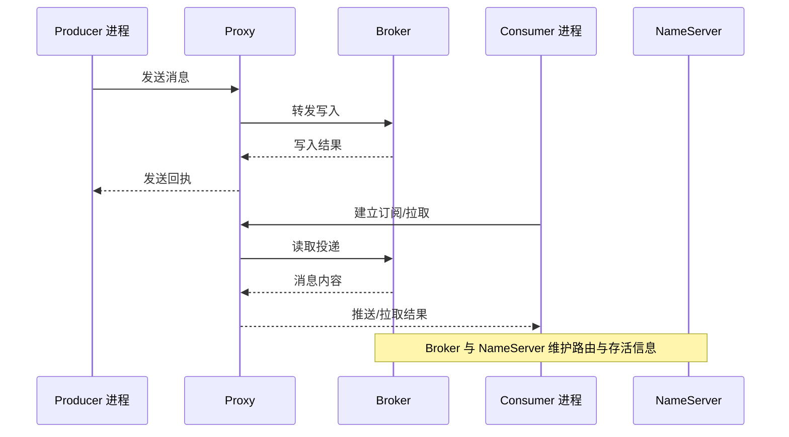

# 阶段 1：架构入门与本地运行

本阶段目标来自 `ROADMAP.md`：建立 **NameServer、Broker、Topic/队列、生产与消费** 的心智模型，并在本机用 **Docker Compose** 跑通 **「路由可达 → 消息落盘 → 消费确认」** 的最小闭环。与动手相关的命令、端口与顺序以同目录下 `demo/README.md` 为准；本文侧重 **为什么这样设计**、**各组件边界** 与 **排障时如何回到拓扑思考**。

**撰写说明**：正文中的机制描述以 Apache RocketMQ **5.x** 公开文档为主；Broker、Proxy 的默认参数与工具命令可能随补丁版本微调，遇到不一致请以官网当前页面为准并在实验记录中记下镜像标签与客户端版本。

**本阶段知识地图**

| 序号 | 路线主题（来自 `ROADMAP.md`） | 对应正文 |
|------|------------------------------|----------|
| 1 | 为什么要消息队列；RocketMQ 在系统中的位置 | 「一」 |
| 2 | NameServer、Broker、Proxy 的分工与数据走向 | 「二」 |
| 3 | Topic、MessageQueue：逻辑与物理视角 | 「三」 |
| 4 | 本地/容器部署、建 Topic、SDK 验证、日志排障 | 「四」 |

**路线要点 ↔ 本文章节**

| `ROADMAP.md` 要点 | 本文展开位置 |
|-------------------|--------------|
| 理解核心组件角色 | 「二」整节；图与段落按调用链解释 |
| 本地或 Docker 拉起 NameServer + Broker（及 5.x 常见 Proxy） | 「二」「四」；与 `demo/docker-compose.yml` 对齐 |
| Topic、Queue/MessageQueue | 「三」 |
| 使用官方示例或命令行验证生产与消费 | 「四」；点名 `demo/java-client/` |
| 查看 Broker / NameServer 日志定位常见问题 | 「四」末段 |

---

## 一、从业务痛点到消息中间件：RocketMQ 要解决的问题与引入成本

当你把一次用户请求里的所有工作都放在同一个 Web 请求链路中完成时，短期开发往往最快：代码线性、调试路径短。随着业务量上升，你会遇到几类**稳定重复**的矛盾：某些步骤耗时长却不影响立刻返回（例如发通知、写审计、同步搜索索引）；某些下游在尖峰期撑不住，直接把上游拖死；某些业务希望以**事件**的方式被多个系统订阅，而不是由上游逐一调用。消息中间件的核心价值，就是把「**何时做**」与「**在哪条线程/进程里做**」拆开：上游尽快把**事实**写成一条**可异步处理**的消息，下游按自己的节奏消费。

Apache RocketMQ 属于典型的**分布式消息中间件**：它提供跨进程的、可集群扩展的**消息存储与投递**能力，并通过 **Topic** 等逻辑抽象把业务面与物理面对齐到同一套语言里。它不是数据库的替代品，也不应该被当成无限容量的内存队列；它是**面向吞吐与解耦**的基础设施，因此必然引入**一致性语义、重复投递、顺序与延迟的权衡、运维与观测**等后续阶段主题。本阶段先把边界说清：你要掌握的不是「会调 API」这一件事，而是**消息从进入系统到被确认消费**这条链路上，每一跳**可能失败在哪里**、**日志与指标为何这样分布**。

**知识点（对应本节）**

| # | 知识点 | 抓住什么 |
|---|--------|----------|
| 1 | 异步解耦 | 上游写事实、下游自治；失败形态从「同步阻塞」转为「堆积/重试」 |
| 2 | 削峰填谷 | 用队列吸收突发；代价是端到端延迟与堆积治理 |
| 3 | 事件入口 | 一条消息多订阅；需要清晰的 Topic 边界与版本治理 |
| 4 | 引入成本 | 至少一次语义、重复、顺序、运维；不能在架构上假装它们不存在 |

### 同步调用的瓶颈在哪里

同步链路里，可靠性往往靠超时、重试与熔断堆出来，但它们的共同前提是：**你仍然占用上游资源等待下游**。当下游变慢，线程池、连接池与网关排队会迅速把问题「传导回入口」，表现为全站延迟上升。消息化之后，入口线程通常只负责**把消息可靠地交给 Broker**（以及处理发送失败时的降级策略），耗时工作被转移到消费者进程。这样做的直觉收益是**保护入口**；代价是**用户体验可能变为最终一致**，你必须用产品文案、状态页、补偿流程把「已经受理」与「已经完成」区分开。

### 为什么选「队列化」而不是更大线程池

线程池只能把计算并行化，无法跨越**进程与机器**的边界，也无法天然提供**可回放、可审计**的持久化轨迹。消息队列把「待办事项」变成**可观测的持久化 backlog**：你能在压力过后继续消费，也能在发布问题时限制爆炸半径。若把队列只放在单机内存里，重启即丢；RocketMQ 的方向是把 backlog **落到 Broker 存储模型**上，并用集群扩展吞吐。你不必在本阶段搞懂存储实现细节，但要记住：**可恢复性**来自 Broker 与副本/部署拓扑，而不是来自客户端本地缓存。

### RocketMQ 的「第一印象」应落在链路上

很多初学者会先把类名背下来，却在排障时不知道去看哪台机器的日志。更稳妥的第一印象是：**谁持有路由**、**谁持有消息**、**谁面向客户端**。在 5.x 的官方快速路径里，客户端常通过 **Proxy** 接入，这与早期大量文章「Producer 直连 NameServer 地址」的示例并存。两者并不矛盾：变化的是**接入与治理边界**，不变的是 **Broker 存消息、NameServer 提供路由发现** 这条主线。你在本阶段结束时，应能用一句话描述一次发送：从客户端到 **Proxy**，再到 **Broker** 落盘，再由消费者拉取或推送处理，最后**确认消费**；其中任一跳断开，都会在特定日志与端口现象上留下痕迹。

**读图目的**：把「客户端看到的接入点」与「真正存消息的组件」分开。上图是教学简化，真实链路在不同部署模式下会有细节差异，但**排障时先对齐组件边界**比死记端口更有效。

---

**本节提要（延伸学习）**

- **核心概念**：异步解耦；削峰；事件多播；同步链路的资源传导；持久化 backlog；接入点与存储点分离。
- **拓展提问提示词**

> 主题：在电商下单链路中引入 RocketMQ 做异步通知。核心概念：异步解耦、削峰填谷、至少一次投递、最终一致。请拓展：列出「同步方案」与「消息化方案」在故障模式上的 6 条对比；给出 3 条必须在产品层声明的用户可见语义；并给出当 Broker 堆积时运维与研发的协同处置清单（可执行步骤，避免空泛口号）。

---

## 二、运行拓扑：NameServer、Broker、Proxy 如何协同

如果把 RocketMQ 想成一座城市：**Broker** 是仓库与配送站，真正堆货；**NameServer** 像路口指示牌与分区地图的发布点，告诉司机仓库在哪条街；**Proxy** 更像统一对外服务台，处理来访流程并把货单转交仓库体系。你的应用程序通常不该「猜」仓库内部细节，而应通过**稳定入口**把消息交给系统；在 5.x 的推荐路径里，这个入口经常落在 **Proxy**。这不是为了把架构变复杂，而是为了在演进中集中处理鉴权、观测、协议治理等横切问题；你在后续阶段会看到更多特性与 Proxy/Broker 分工相关。

本节的论证目标是：当你看到端口、容器名与日志前缀时，能判断**当前问题属于路由不可达、接入层拒绝、还是 Broker 存储/投递异常**。这比记住每个线程栈更有用。

**知识点（对应本节）**

| # | 知识点 | 抓住什么 |
|---|--------|----------|
| 1 | NameServer | 路由注册与发现；自身不存业务消息 |
| 2 | Broker | Topic/队列与消息存储、消费进度协作的关键执行者 |
| 3 | Proxy | 5.x 客户端常见接入点；把外部协议与内部集群治理衔接起来 |
| 4 | 调用链直觉 | 先对齐「谁保存状态、谁只转发元数据」 |

### NameServer：轻量的路由协调者

NameServer 在 RocketMQ 体系里承担的是**路由信息的权威发布**角色：Broker 启动后会向 NameServer 报告自己负责的队列与 Topic 分布，客户端在发送/订阅前需要拿到**可用的路由视图**。教学上最常强调的点是：NameServer **不是**消息存储节点，也不应被当成「配置中心全家桶」。它的故障影响主要是**路由不可见或滞后**，表现为客户端找不到队列、发送失败、消费无法均衡分配等；这类问题优先查 **NameServer 与 Broker 的心跳、网络分区、容器 DNS**。

### Broker：消息与队列的归属地

Broker 负责把消息写入 **MessageQueue** 所代表的物理分片，并协同消费者进度、过滤、重试等机制（后续阶段逐项展开）。因此，绝大多数「消息到底有没有进系统」的问题，最终要能在 **Broker 日志与队列堆积现象** 上得到解释。你在本阶段可以建立一个习惯：发送失败时先看 **Proxy/Broker 是否连通**，再看 **Topic 是否存在、消息类型是否匹配**；消费不到时先看 **订阅关系与消费者组**，再看 **路由是否更新**。

### Proxy：为什么官方 Compose 路径常常带上它

在 5.x 的官方 Docker Compose 快速开始中，常见组合是 **NameServer + Broker + Proxy**，Java 示例使用 **`rocketmq-client-java`** 并连接 **Proxy 的 endpoints**。这与旧文章只用 `rocketmq-client` 直连 NameServer 的写法不同。对学习者而言，最重要的是建立**版本与路径匹配**意识：跟随官方文档时，**镜像、Proxy、客户端三者的组合**是一套的；混用旧客户端教程连接新集群，往往会卡在认证、协议或路由字段不一致等「看起来莫名其妙」的地方。若你维护老系统，也要把「迁移映射表」记进团队文档：哪些端口对应 Proxy，哪些对应 Broker 对外协议，避免防火墙开错洞。

### 拓扑视角下的排障顺序（入门版）

1. **容器/进程是否存活**：NameServer、Broker、Proxy 是否都在运行。  
2. **网络是否可达**：容器间用服务名互通；宿主机客户端用映射端口。  
3. **路由是否新鲜**：Broker 是否注册到 NameServer；客户端是否拿到路由。  
4. **资源是否声明正确**：Topic 是否存在；5.x 是否声明了 **消息类型** 等与发送一致。  

这不是终极清单，但足够把「玄学问题」压缩到**可定位的类别**。

---

**本节提要（延伸学习）**

- **核心概念**：NameServer（路由）；Broker（存储与投递）；Proxy（常见接入）；路由视图；消息不落 NameServer。
- **拓展提问提示词**

> 主题：RocketMQ 5.x 本地 Docker Compose（含 Proxy）与经典 4.x 直连 NameServer 客户端差异。核心概念：NameServer、Broker、Proxy、路由发现、接入点。请拓展：用两张表分别对比「客户端连接串/端口」「故障现象 → 优先查看日志的组件」；并给出一次「Proxy 端口映射错误」的完整排障叙述（含验证命令）。

---

## 三、Topic 与 MessageQueue：逻辑容器与物理分片的关系

官方域模型把 **Topic** 描述为**逻辑上的消息类别容器**：业务上你用 Topic 做隔离与授权边界；真正决定并发度、扩展与许多语义细节的是其下的 **MessageQueue**（消息队列/队列分片）。一句话：**Topic 像书名，MessageQueue 像章节页码的物理分页**。你在设计 Topic 时常犯的错误有两个极端：一是**过粗**，所有业务塞进一个 Topic，导致隔离与治理困难；二是**过细**，Topic 数量爆炸，运维与权限成本上升。入门阶段先建立「**一个 Topic 内多队列**」的直觉即可。

**知识点（对应本节）**

| # | 知识点 | 抓住什么 |
|---|--------|----------|
| 1 | Topic | 逻辑分类、权限与观测边界 |
| 2 | MessageQueue | 并行与扩展的基本单位；与顺序性强相关 |
| 3 | 消息类型（5.x） | Topic 元数据上声明类型，发送需一致 |
| 4 | 生产建议 | 测试可自动建主题；生产应治理化创建 |

### Topic：先正确分类，再谈高级特性

Topic 划分没有唯一标准，但有可操作的判据：**是否同一类业务事实**、**是否需要独立扩缩与告警**、**失败爆炸半径是否应隔离**。例如「订单状态变更」和「营销短信」通常不应硬塞进同一 Topic：它们的峰值、延迟容忍与重试策略不同。你不必一开始追求完美，但要避免「一个 Topic 走天下」的惯性。

### MessageQueue：并行与顺序的交汇点

消费者组内的多个消费者实例，通常会以队列分片为单位做负载分担。队列越多，**并行消费的上限**越高；但顺序性往往只能保证在**单个队列**内（全局顺序是另一套代价）。因此，「要更快」与「要更严的顺序」常常互相拉扯。本阶段只需记住：**扩容消费者不是无限提速**，受队列数、消费逻辑耗时、下游瓶颈共同约束。

### 5.x 的消息类型：为什么本阶段就要知道

从 5.x 开始，官方文档强调 Topic 与 **消息类型** 的一致性校验能力（具体默认开关以集群参数与版本为准）。这意味着你在用 `mqadmin` 建 Topic 时，最好显式带上 **`message.type`**，避免后续发送被以「类型不匹配」拒绝。该要求看似繁琐，但它把「线上偶发写错类型」的问题前移到**创建资源**阶段，更符合生产治理。

---

**本节提要（延伸学习）**

- **核心概念**：Topic（逻辑）；MessageQueue（分片）；并行上限；顺序粒度；消息类型一致性。
- **拓展提问提示词**

> 主题：RocketMQ Topic 与 MessageQueue 对扩展性与顺序性的影响。核心概念：Topic、MessageQueue、消费者组负载均衡、队列内顺序。请拓展：举一个「3 个队列、2 个消费者实例」的分配直觉例子；再给出一个「错误假设全局顺序」的反例说明；最后列出在 5.x 下创建 Normal 类型 Topic 的 mqadmin 关键参数及每条参数的含义。

---

## 四、本地最小闭环：Compose 拉起、mqadmin、SDK 收发与日志阅读

本阶段实践的主线应与 `demo/README.md` 同步：**Compose 启动三组件 → `mqadmin` 创建 Topic（含消息类型）→ 先启动消费者再发送 → 观察日志**。这里补充「为什么是这个顺序」：消费者启动会建立订阅与路由拉取路径，先启动有助于你观察**从空队列到第一条消息**的完整现象；若你反向操作，也能工作，但初学者更容易把「没消费」误判为「没发到」。

**知识点（对应本节）**

| # | 知识点 | 抓住什么 |
|---|--------|----------|
| 1 | Compose | 单节点最小栈；端口映射与宿主机访问方式 |
| 2 | mqadmin | 资源治理的缩微练习；参数与集群名要匹配 |
| 3 | `rocketmq-client-java` | 通过 Proxy `endpoints` 接入 |
| 4 | 日志 | NameServer/Broker/Proxy 的分工读法 |

### 推荐路径：对齐官方，减少「版本漂移」

官方提供二进制、Docker 与 Compose 多条路径。对本仓库学习而言，**Compose** 的优势是可重复、可版本化：你把镜像 tag 写在文件里，就等于把实验环境「钉」在一页纸上。升级时应有意识地同时评估 **Broker 与客户端** 的兼容性，而不是只改一边。

### mqadmin：把「资源存在」变成显式事实

在测试环境自动创建 Topic 很方便，但生产上更推荐**变更流程化**：谁创建、谁审批、如何回滚。你在本阶段练习 `mqadmin`，重点不是背全量子命令，而是理解：**Topic 是全局可见资源**，它的属性（队列数、类型、权限）会影响所有上下游。若命令失败，优先核对 **NameServer 地址**、**集群名**、**Broker 角色** 是否与 compose 默认值一致。

### SDK：先跑通，再谈抽象

`rocketmq-client-java` 的示例里，**Producer** 在初始化时会绑定 **Topic**；**PushConsumer** 需要 **ConsumerGroup** 与 **订阅表达式**。初学者常见错误是把 **Proxy 端口** 与 **NameServer 端口** 混用。请你对照 `demo/docker-compose.yml` 的映射，确认 Java 里的 `endpoints` 指向 **Proxy 映射到宿主机的端口**。

### 日志阅读顺序：从现象回到拓扑

当出现「发送失败」时，建议顺序是：**客户端异常信息** → **Proxy 日志**（若接入层拒绝）→ **Broker 日志**（存储/权限/队列）→ **NameServer 日志**（路由注册异常）。当出现「消费不到」时，先看 **订阅与消费组** 是否匹配，再看 **是否有堆积**、**路由是否更新**。这套顺序不是官方唯一标准，但它遵循**从外到内**的排障经济学。

---

**本节提要（延伸学习）**

- **核心概念**：Compose 最小栈；`mqadmin` 建 Topic；`endpoints`；先消费后发送的课堂顺序；从外到内的日志阅读。
- **拓展提问提示词**

> 主题：RocketMQ 5.x 本地 Compose 实验排障。核心概念：NameServer、Broker、Proxy、mqadmin、Topic 消息类型、rocketmq-client-java。请拓展：设计一张检查表覆盖「容器未起」「端口映射错误」「Topic 未建」「消息类型不匹配」「订阅表达式不匹配」五类问题；每类给出 2 条具体证据（日志片段或现象描述）与 1 条验证动作。

---

## 推荐阅读

说明在前、链接行仅 URL（复制时请勿夹带行内中文说明）。

- **Apache RocketMQ 官方网站（总入口）**
  - 与本阶段：获取文档导航、版本与社区资源的入口。
  - https://rocketmq.apache.org/
  - 检索：`Apache RocketMQ official site`

- **概念（Concepts）**
  - 与本阶段：建立 Topic、MessageQueue、Producer、ConsumerGroup 等术语的一致理解。
  - https://rocketmq.apache.org/docs/introduction/02concepts/
  - 检索：`RocketMQ Concepts Topic MessageQueue`

- **Topic（域模型）**
  - 与本阶段：理解 Topic 与队列关系、5.x 消息类型与创建注意事项。
  - https://rocketmq.apache.org/docs/domainModel/02topic/
  - 检索：`RocketMQ domain model topic message type`

- **Quick Start（二进制/通用入门）**
  - 与本阶段：对照官方最小步骤与术语，理解「从下载到跑通」的主线。
  - https://rocketmq.apache.org/docs/quickStart/01quickstart/
  - 检索：`RocketMQ quick start`

- **Run RocketMQ in Docker**
  - 与本阶段：理解容器启动 NameServer/Broker 的基本参数与网络。
  - https://rocketmq.apache.org/docs/quickStart/02quickstartWithDocker/
  - 检索：`RocketMQ quick start docker`

- **Run RocketMQ with Docker Compose**
  - 与本阶段：与本仓库 `demo/docker-compose.yml` 与 Java 示例路径最直接对齐。
  - https://rocketmq.apache.org/docs/quickStart/03quickstartWithDockercompose/
  - 检索：`RocketMQ docker compose quickstart`

- **rocketmq-clients（官方客户端示例仓库）**
  - 与本阶段：对照 Java 发送与消费的最新示例代码与变更说明。
  - https://github.com/apache/rocketmq-clients
  - 检索：`apache rocketmq-clients GitHub`
