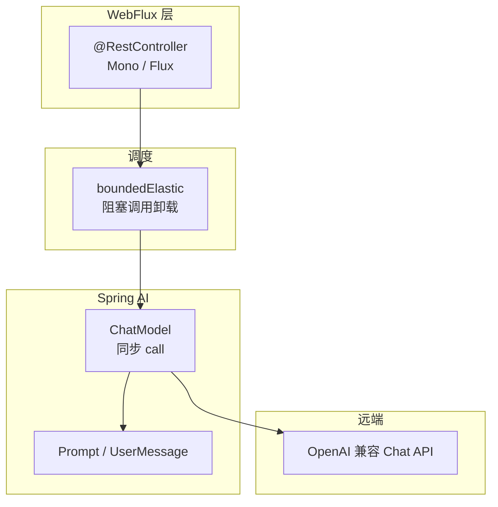

# 阶段：WebFlux 环境与 Spring Boot 集成 — 理论知识

## 本阶段学习目标

与 [`ROADMAP.md`](../ROADMAP.md) 中阶段 1 对齐，学完应做到：

1. 使用 **JDK 17+**、**Maven**（或 Gradle）搭建 **Spring Boot + WebFlux + Spring AI** 最小工程。
2. 理解 **Spring AI BOM** 的作用，并正确引入 **`spring-ai-starter-model-openai`**（或按文档替换为其他模型 Starter）。
3. 能在 **`application.yaml`** 中配置 **`spring.ai.openai.api-key`**（推荐 `${OPENAI_API_KEY}`），并理解密钥不落库、不入 Git。
4. 能在 WebFlux 中注入 **`ChatModel`**，完成一次**阻塞式**对话调用；并理解为何需在 **`boundedElastic`** 上执行，避免阻塞 Netty **事件循环线程**。
5. 能独立排查：**401（密钥错误）**、**超时**、**模型名错误**、依赖冲突等常见问题。

## 核心概念与知识图谱



**读图要点**：浏览器/客户端访问 WebFlux；控制器返回 `Mono`；内部若调用**阻塞型** `ChatModel`，应通过 `subscribeOn(Schedulers.boundedElastic())` 等方法把阻塞工作从事件循环线程挪走。

## 核心概念

### Spring AI 在本阶段要解决什么

企业里对接大模型时，痛点往往是：**各家厂商 SDK 不同、配置分散、难以替换**。Spring AI 提供与 Spring 一致的 **自动配置**、**统一抽象**（如 `ChatModel`），让你在切换供应商时尽量只改依赖与配置，而不是重写业务代码。

本阶段只用到其中最基础的一层：**同步 Chat 调用**，先把「工程能跑、密钥能对、能发出第一条模型回复」走通。

### Spring Boot 与 Spring WebFlux

- **Spring Boot**：约定优于配置，提供 **`spring-boot-starter-parent`**、依赖管理与 **`@SpringBootApplication`** 启动入口。
- **WebFlux**：基于 **Reactor**（`Mono`/`Flux`）与 **Netty** 的响应式 Web 栈；适合 SSE、流式输出（后续阶段重点）。本阶段接口可先返回 **`Mono<String>`**。

**重要约束**：不要在同一应用里默认同时引入 **`spring-boot-starter-web`**（Spring MVC）与 **`spring-boot-starter-webflux`**，除非清楚混用带来的线程模型与代码路径问题；本专题路线固定 **WebFlux**。

### Spring AI BOM 与 Starter

- **BOM（Bill of Materials）**：`spring-ai-bom` 统一 Spring AI 相关 artifact 的**推荐版本**，避免各模块版本不一致。
- **Starter**：如 **`spring-ai-starter-model-openai`**，引入 OpenAI Chat 的自动配置与默认 Bean（具体 Bean 名称与属性前缀以当前版本 Reference 为准）。

在 `pom.xml` 中典型做法是：`dependencyManagement` 导入 BOM，再在 `dependencies` 里写 Starter **不写版本号**。

### ChatModel 与 Prompt（本阶段最小闭环）

- **`ChatModel`**：表示「可对模型发起一次 Chat 请求」的抽象；本阶段使用其 **同步** `call` 方法即可。
- **`Prompt`**：封装发给模型的消息集合；常见写法是用 **`UserMessage`** 携带用户文本。

调用成功后得到 **`ChatResponse`**，从中取出模型回复文本（本仓库示例使用 Spring AI **1.0.6**，助手消息 **`AssistantMessage`** 上取正文常用 **`getText()`**；具体 getter 以你所用版本的 **Chat Model API / Javadoc** 为准）。

### WebFlux 中调用阻塞型 ChatModel 的原因与写法

`ChatModel` 的同步调用在内部往往会发起 **阻塞式 HTTP** 或长时间等待；若在 Netty **事件循环线程**上直接执行，会拖慢整个服务的请求处理能力。

常见做法是：

- 使用 **`Mono.fromCallable(...)`** 包裹阻塞调用；
- 再配合 **`subscribeOn(Schedulers.boundedElastic())`**，把执行调度到适合阻塞任务的线程池。

本仓库 **`demo/`** 中的控制器展示了这一组合。

### 配置与安全：`spring.ai.openai.api-key`

官方文档约定使用 **`spring.ai.openai.api-key`**。推荐：

```yaml
spring:
  ai:
    openai:
      api-key: ${OPENAI_API_KEY}
```

在操作系统或 CI 中设置环境变量 **`OPENAI_API_KEY`**，**不要把密钥写入仓库**。

### 故障排查速查

| 现象 | 可能原因 | 方向 |
|------|----------|------|
| 401 / Unauthorized | API Key 错误或未传入 | 检查环境变量、Profile、`application-local.yml` |
| 超时 | 网络、代理、模型负载 | 调整超时配置（属性名以 Reference 为准）、检查防火墙 |
| 模型不存在 | `spring.ai.openai.chat.options.model` 写错 | 对照服务商模型列表 |
| 启动失败 / Bean 缺失 | Starter 未引入或与 Boot 版本不兼容 | 核对 BOM、Boot 版本是否在官方支持矩阵内 |

## 与上一阶段的衔接

这是本专题的入门阶段；前置假设你已会使用 Spring Boot 创建工程并理解依赖注入。

## 与下一阶段的衔接

下一阶段将引入 **`StreamingChatModel`** / ChatClient **流式** API，并在 WebFlux 中用 **`Flux`** 与 **SSE** 推送 Token 流；本阶段掌握的 **BOM、配置、不在事件线程上阻塞** 仍是基础。

## 常见误区与注意点

1. **在 WebFlux 控制器里直接阻塞**：不显式卸载调度时，容易阻塞 Netty IO 线程，导致整体吞吐骤降。
2. **把 API Key 写进仓库**：应用 GitHub Secret、本地环境变量或机密管理方案。
3. **忽略官方版本矩阵**：Spring AI 与 Spring Boot  major/minor 需落在文档声明的支持范围内（当前文档表述为 Spring Boot **3.4.x / 3.5.x**，请以页面为准）。
4. **混淆 MVC 与 WebFlux**：路由、过滤器、测试工具（`MockMvc` vs `WebTestClient`）均不同，本路线统一 WebFlux。

## 自检清单

- [ ] 能在解释的前提下写出：`Mono.fromCallable` + `subscribeOn(boundedElastic)` 的作用。
- [ ] 能说出 BOM、Starter、自动配置三者在本阶段的分工。
- [ ] 能独立配置 `${OPENAI_API_KEY}` 并成功调用一次 `/api/chat`。
- [ ] 遇到 401 时能优先怀疑密钥与环境变量传递链路。

## 推荐阅读与扩展资料

以下链接在撰写本文时（2026-05-08）经检索核对为官方入口；若日后失效，请用检索关键词更新。

- **Spring AI — Getting Started** — https://docs.spring.io/spring-ai/reference/getting-started.html（安装、仓库、BOM、与 Spring Boot 版本关系）
- **Spring AI — OpenAI Chat** — https://docs.spring.io/spring-ai/reference/api/chat/openai-chat.html（`spring-ai-starter-model-openai`、`spring.ai.openai.api-key` 等）
- **Spring Framework — WebFlux** — https://docs.spring.io/spring-framework/reference/web/webflux.html（响应式 Web 栈总览）
- **Spring AI — Chat Model API** — https://docs.spring.io/spring-ai/reference/api/chatmodel.html（`ChatModel` / `StreamingChatModel` 概念入口）
- **Spring Initializr** — https://start.spring.io/（勾选 **Spring Reactive Web** 与所需 AI 模块生成骨架）

**检索关键词**：`Spring AI BOM`、`spring-ai-starter-model-openai`、`spring.ai.openai.api-key`、`Spring WebFlux boundedElastic ChatModel`、`Spring Boot 3.4 Spring AI`。

## 本阶段理论知识小结

- WebFlux 搭配「阻塞型」模型调用时，要用 **`boundedElastic`** 等策略避免阻塞 Netty 事件线程。
- 用 **Spring AI BOM** 管理版本，用 **Starter** 启用自动配置。
- **密钥走环境变量**，代码与 Git 中不落明文。
- 先跑通同步 **`ChatModel`**，再进入流式与 SSE 阶段。
